# Arduino Fundamentals
**Arduino**
- an open-source electronics platform
- Arduino boards are able to read inputs-light on a sensor, a finger on a button or a Twitter message - and turn it into an output - activating a motor, turnning on an LED

---
# Resources
- [Arduino Documentation](https://docs.arduino.cc/)
- [Arduino Cloud](https://docs.arduino.cc/arduino-cloud/)
- [Official Tutorials](https://docs.arduino.cc/tutorials/)
- [Learn Arduino](https://docs.arduino.cc/learn/)

---
# Key components
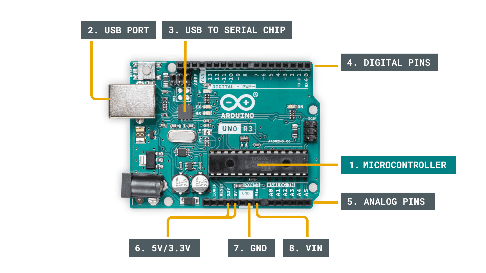
- **Microcontroller**
  - the brain of Arduino
  - the component that we load programs into
  - designed to execute only a specific number of things
- **USB port**
  - used to connect Arduino board to a computer
- **USB to Serial chip**
  - helps translate data that comes from e.g. a computer to the on-board microcontroller
  - this is what makes it possible to program the Arduino board from computer
- **Digital pins**
  - use digital logic (0, 1 or LOW/HIGH)
  - commonly used for switches and to turn on/off an LED
- **Analog pins**
  - pins that can read analog values in a 10 bit resolution (0-1023)
- **5V / 3.3V pins**
  - used to power external components
- **GND**
  -  also known as `ground`, `negative` or simply `-`, is used to complete a circuit, where the electrical level is at 0 volt
  -  相当于电路的“负极”（GND类似于电路的“地”，电流从VCC流出，经过元件，最后回到GND）
- **VIN**
  - stands for Voltage In, where you can connect external power supplies
  - Arduino 的电源输入引脚。如果用外部电源（比如电池或适配器）给 Arduino 供电，可以接到 Vin。可以简单理解为Arduino 的“充电口”
- **VCC**
  - 代表电路的正电源电压，相当于电路的“正极”
  - 在 Arduino 板上，VCC 通常是 5V 或 3.3V，具体取决于你使用的 Arduino 型号和电路设计。
  - 5V：大多数 Arduino 板（如 Arduino Uno）提供 5V 的 VCC。
  - 3.3V：一些 Arduino 板（如 Arduino Due 或 ESP8266/ESP32）提供 3.3V 的 VCC。
  - 用来为电路中的组件（如传感器、LED、电阻等）提供电源

---
# Connection
TX 和 RX 引脚：
- Arduino Uno 的 TX（发送） 和 RX（接收） 引脚用于串行通信。
- 通常情况下，Arduino 的 TX 引脚应该连接到外部设备的 RX 引脚，Arduino 的 RX 引脚应该连接到外部设备的 TX 引脚。这是因为发送端（TX）需要与接收端（RX）相连，以实现双向通信。

---
# Basic Operation
- The program that is loaded to the microcontroller will start execution as soon as it's powered
- Every program has a function called "**loop**", in which you can:
  - Read a sensor
  - Turn on a light
  - Check whether a condition is met
  - etc.
- The speed of a program is fast, unless tell it to slow down
  - depends on the sice of the program and how long it takes for the microcontroller to execute it

The basic operation of an Arduino:
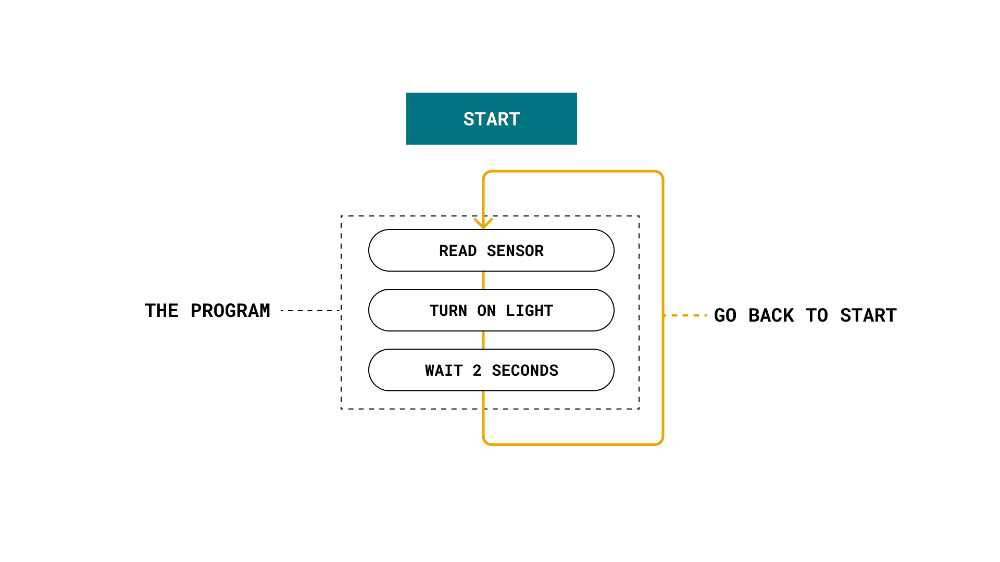


## Communication through Arduino
- **Inputs** ➡️ **Sensors**
  - Take inputs from the physical and turn it into electronic signals
  - Push putton, light-dependent resistors/phototransistor
- **Outputs** ➡️ **Actuators**
  - Take electric signals and perform an action
  - LEDs, motors, speakers ...

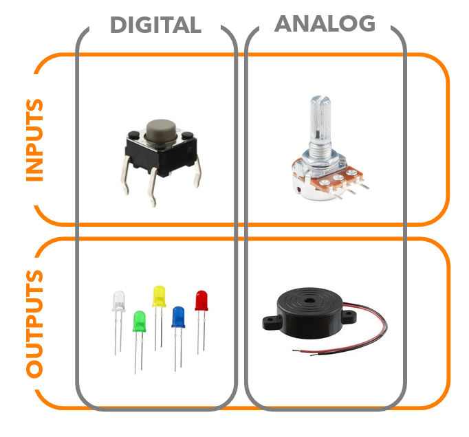

- **Digital Inputs** (数字输入)
  - 上图为**按钮**，仅提供按下（ON）或未按下（OFF）
  - 按下时发送高电平信号（HIGH）
  - 松开时发送低电平信号（LOW）
- **Analog Inputs** (模拟输入)
  - 图中为**电位器**
  - 电位器提供连续的电压值，随旋钮转动而变化
  - Arduino读取这个电压值来确定旋钮的位置，处理模拟信号
- **Gigital Outputs** (数字输出)
  - 图中LED，通常只有两种状态：亮（ON）或灭（OFF）
  - Arduino通过发送高电平或低电平信号来控制LED的亮灭
- **Analog Outputs** (模拟输出)
  - 图中**蜂鸣器**可以产生不同频率的声音
  - Arduino通过发送脉宽调制（Pulse-Width Modulation: PWM）信号来控制蜂鸣器的音调和音量，处理模拟信号

### Electronic Signals
#### Analog Signal
==模拟信号是**连续**的==
- is generally bound to a range
- typically 0-5V, or 0-3.3V in an Arduino
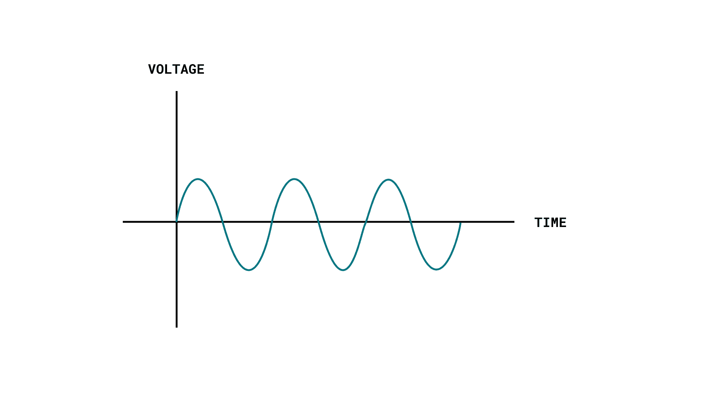

#### Digital Signal
==数字信号是**离散**的==
- represents only two **binary states** (**0 or 1**)
  - are read as **high** or **low** states in the program
  - the most common signal type in modern technology
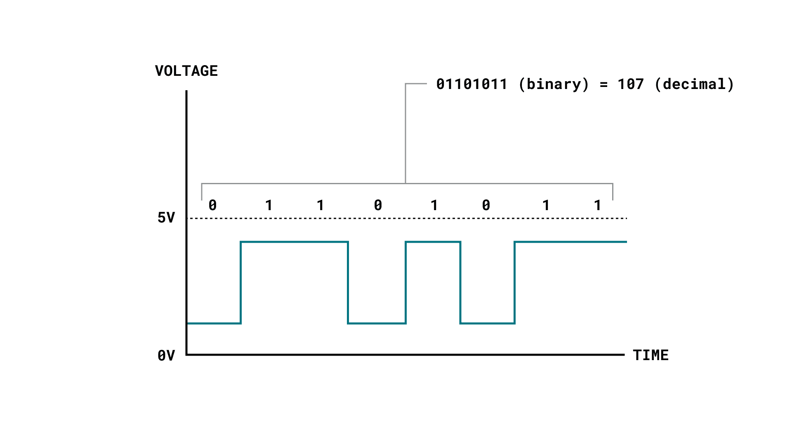


---
## Circuit Basics
**LED Circuit**: an example of a circuit
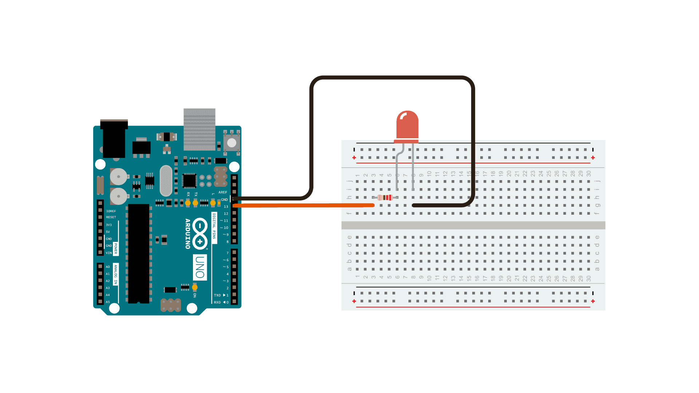
- <div style="color: grey;">Arduino控制LED(Light Emitting Diode)的亮灭。电路中，LED的正极连接到Arduino的一个数字引脚，负极通过一个电阻接到地（GND）。电阻的作用是保护LED，防止电流过大烧坏LED。当引脚设置为高电平（HIGH）时，电流通过电路，LED亮起；当引脚设置为低电平（LOW）时，电流不通过电路，LED熄灭</div>


---
# Programming Language
- based on Wiring, and the Arduino Software (IDE), based on Processing
- **Serial Monitor** 
  - built-in Arduino IDE feature
  - Helpful for:
    - trouble shooting
    - serial communication
  - 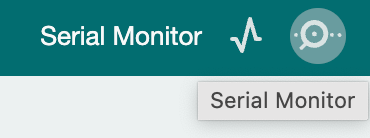
  - For Arudino, serial communication works on Digital Pins 0 and 1, so these Pins can not be used for a digital input or output

## Functions
- **pinMode()** 
  -  2 parameters:
     -  pin parameter: determines the pin member to configure
     -  mode parameter: determines whether the pin operates as an input or an output
     -  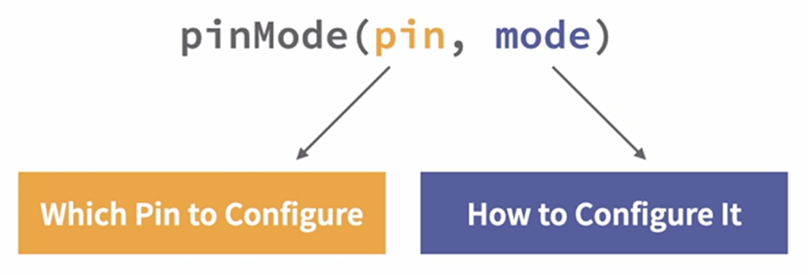
  - 3 values you can use for the interface mode setting
     -  INPUT in order to set it for a normal input mode
     -  INPUT_PULLUP is in order to set it for an input mode, but uses an internal pull-up resistor
     -  OUTPUT in order to set it as an output mode. 
     -  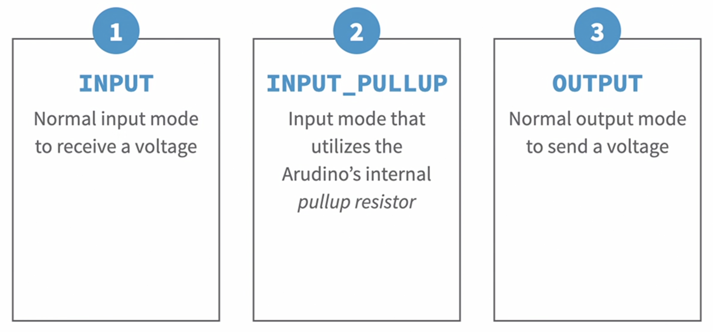
- **digitalWrite Function** 
  - used to output a value to a pin that has been configured as an output
  - 用于控制数字引脚输出高电平（HIGH）或低电平（LOW）
    - 该函数只能在引脚被配置为**输出模式(OUTPUT)** 时才能正常工作
    - 如果引脚被配置为**输入模式(INPUT)**，`digitalWrite()`将无法改变引脚的状态，因为它没有控制引脚输出的能力
  - `digitalWrite(pin, value)`
  -  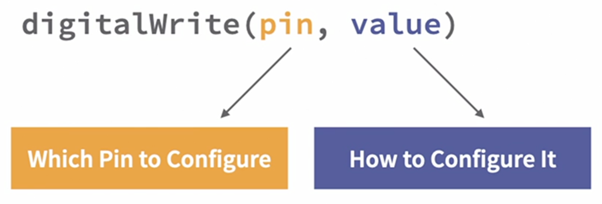
- **delay Function** 
  -  
  -  example: let the 13LED light for 1 second and turn off for 0.5 second
    ```
    int LED=13;
    void setup() {
    pinMode(LED,OUTPUT);
    }
    
    void loop() {
    digitalWrite(LED,HIGH);
    delay(1000);
    digitalWrite(LED,LOW)
    dealy(500);
    }
    ```

---
## LED
- Diode: electrical componnet that allows current to flow in one direction
- LEDs have polarity ➡️ will only light up if you orient the legs properly. 
- Identifying the Anode & Cathode
  - Anode lead is **longer**
  - Cathode lead is **shorter**
- example: coding a digital traffic signal
  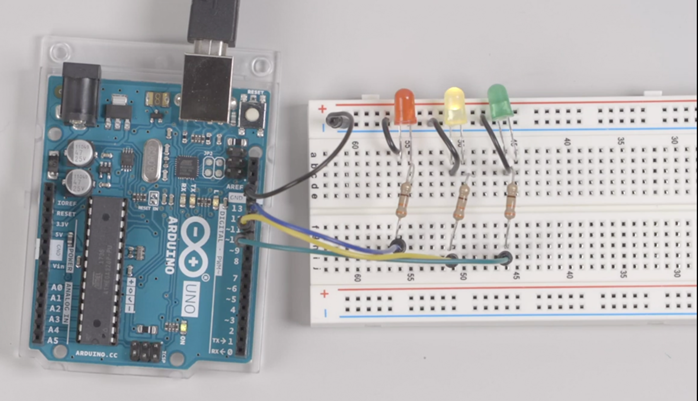
  ```dotnetcli
  //first step: initiate variables
  int GreenLed=10;
  int YellowLed=11;
  int RedLed=12;
  
  void setup() {
  pinMode(GreenLed,OUTPUT);
  pinMode(YellowLed,OUTPUT);
  pinMode(RedLed,OUTPUT);
  
  // the LEDs are off to start with
  digitalWrite(GreenLed,LOW);
  digitalWrite(YellowLed,LOW);
  digitalWrite(RedLed,LOW);
  
  //initialize the serial communication at 9,600 rate
  Serial.begin(9600);
  }
  
  void loop() {
  //Yield Mode 黄灯
  digitalWrite(GreenLed,LOW);
  digitalWrite(YellowLed,HIGH);
  digitalWrite(RedLed,LOW);
  Serial.println("Light Mode: Yield");
  delay(1000); // the yellow led light for 1 second
  
  //Go Mode 绿灯
  digitalWrite(GreenLed,HIGH);
  digitalWrite(YellowLed,LOW);
  digitalWrite(RedLed,LOW);
  Serial.println("Light Mode: Go");
  delay(2000); // the green led light for 2 seconds
  
  //Stop Mode 红灯
  digitalWrite(GreenLed,LOW);
  digitalWrite(YellowLed,LOW);
  digitalWrite(RedLed,HIGH);
  Serial.println("Light Mode: Stop");
  delay(2000); // the red led light for 2 seconds
  }
  ```

---
## Current Limiting Resistor
- used in a circuit to ensure that a maximum current is not exceeded
- 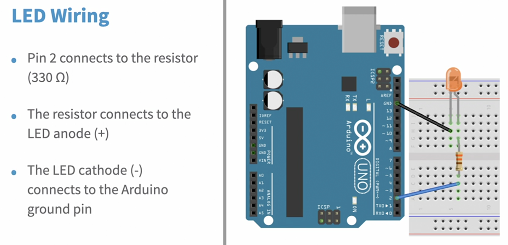

---
## Button
- A switch or button in an Arduino circuit requires a **pullup** or **pulldown** resistor
  - 这是因为当开关断开时，引脚的电平会处于“悬空”状态（不确定是高电平还是低电平），这会导致 Arduino 读取到不稳定的值
  - 上拉或下拉电阻的作用是确保开关断开时，引脚有一个明确的电平（高或低）
- If we are using switch or push button, we usually refer to them as an **active high switch or push button** or an **active low switch or push button**
  - 当我们使用开关或按钮时，通常会根据它们的工作方式将其分为“高电平有效”（Active High）或“低电平有效”（Active Low）：
    - 高电平有效（Active High）：当按下按钮时，引脚读取到高电平（HIGH）
    - 低电平有效（Active Low）：当按下按钮时，引脚读取到低电平（LOW）
- 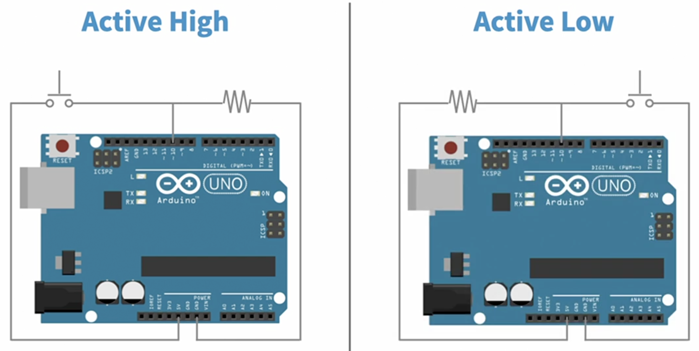
- Active High vs. Active Low Resistors
  - Active High ➡️ Pulldown Resistor
    - 如果使用“高电平有效”的开关，通常需要连接一个下拉电阻
    - 下拉电阻的作用是确保开关未按下时，引脚被拉低到低电平（LOW）
    - 当按下开关时，引脚会被连接到高电平（HIGH）
  - Active Low ➡️ Pullup Resistor
    - 如果使用“低电平有效”的开关，通常需要连接一个上拉电阻
    - 上拉电阻的作用是确保开关未按下时，引脚被拉高到高电平（HIGH）
    - 当按下开关时，引脚会被连接到低电平（LOW）

|                                                             Active High                                                              |                                                       Active Low                                                       |
| :----------------------------------------------------------------------------------------------------------------------------------: | :--------------------------------------------------------------------------------------------------------------------: |
| <p>When the switch/button is activated, it send a high signal.</p> When the switch is not pressed, it's pressed, it send a low value | <p>When the switch/button is activated, it send a low signal.</p> When the switch is not pressed, it send a high value |
|                            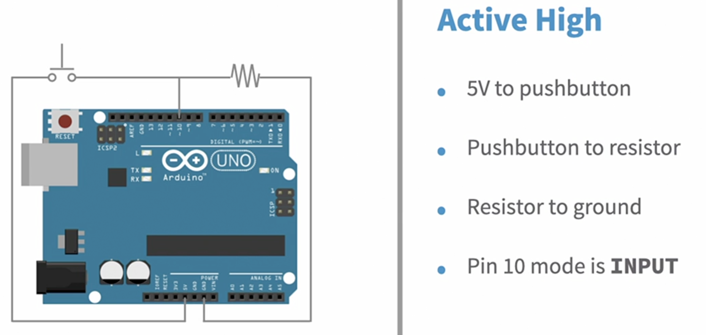                             |                      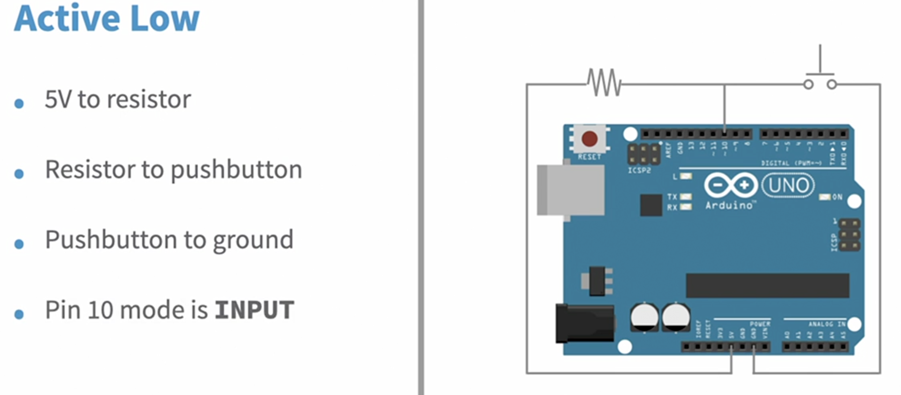                       |
|                                                                                                                                      |


Example: wire a pushbutton to Arduino
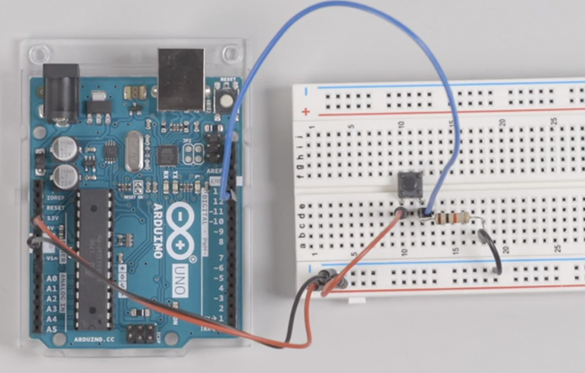
  ```
  int pushButton = 12;
  
  void setup() {
  Serial.begin(9600);
  pinMode(pushButton, INPUT);
  }
  
  void loop() {
  int buttonState = digitalRead(pushButton);
  if (buttonState==HIGH)
  {
  Serial.print("Pushbutton is pressed, value is : ");
  Serial.println(buttonState);
  }
  delay(1000);
  }
  ```

Example: LED turns on when push the button
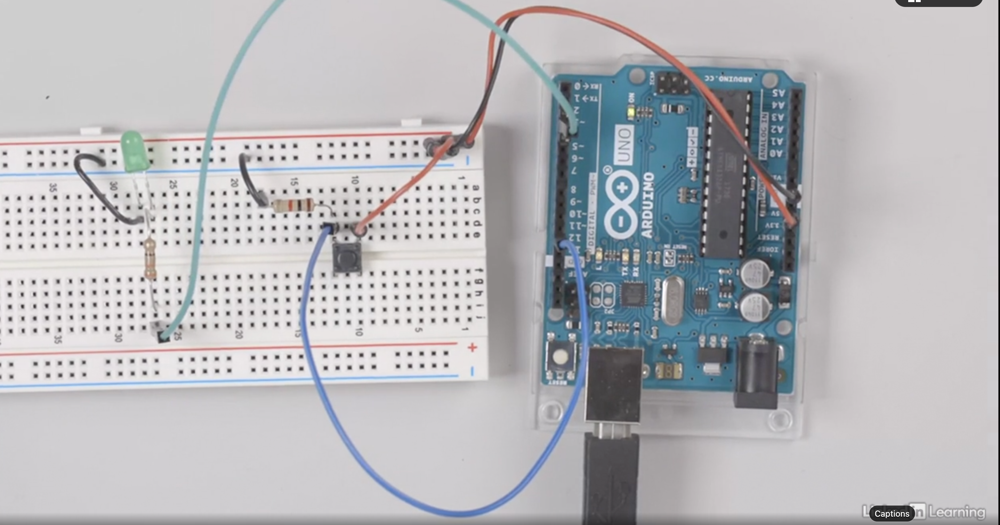
  ```
  int pushButton = 12; //将数字引脚 12 定义为按钮的输入引脚
  int LED = 3;         //将数字引脚 3 定义为 LED 的输出引脚
  
  void setup() {
    Serial.begin(9600);  // 初始化串口通信（用于在串口监视器中显示信息），波特率为 9600
    pinMode(pushButton, INPUT); // 将按钮引脚设置为输入模式,用于读取按钮的状态
    pinMode(LED, OUTPUT);       // 将 LED 引脚设置为输出模式，用于控制 LED 的亮灭
  }
  void loop() {
    int buttonState = digitalRead(pushButton);  // 读取按钮的状态
    if (buttonState == HIGH) {      // 如果按钮被按下（状态为 HIGH）
      digitalWrite(LED, HIGH);      // 点亮 LED
      Serial.print("Pushbutton is pressed, value is : ");
      Serial.println(buttonState);  // 在串口监视器中显示按钮被按下的信息
    } else {                        // 如果按钮未被按下（状态为 LOW）
      digitalWrite(LED, LOW);       // 熄灭 LED
    }
    delay(1000);                    // 等待 1 秒钟
  }
  ```

## Using the built-in LED with INPUT_PULLUP
- Digital pin 13 on arduino board is special, as it has a resistor and led connected to it all the time


---
# Arduino Troubleshooting
[Arduino Troubleshooting](https://www.arduino.cc/en/Guide/Troubleshooting)


|                              e.g. Wrong Connection                               |                              e.g. Correct Connection                               |
| :------------------------------------------------------------------------------: | :--------------------------------------------------------------------------------: |
| 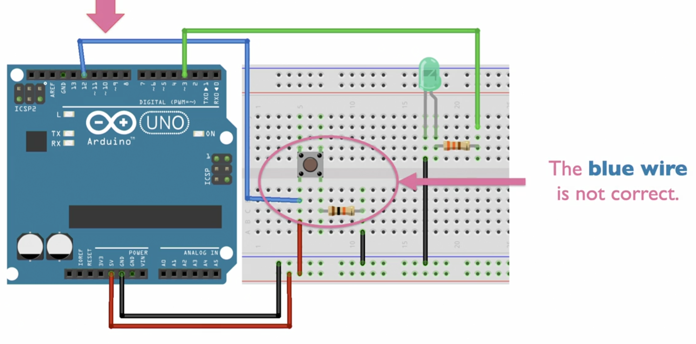 | 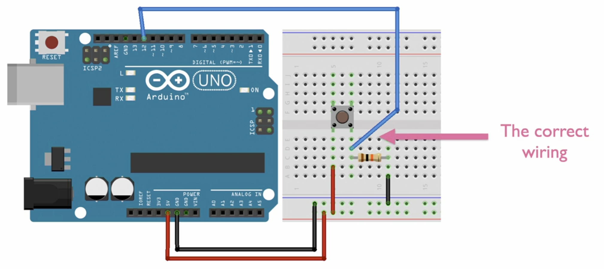 |

