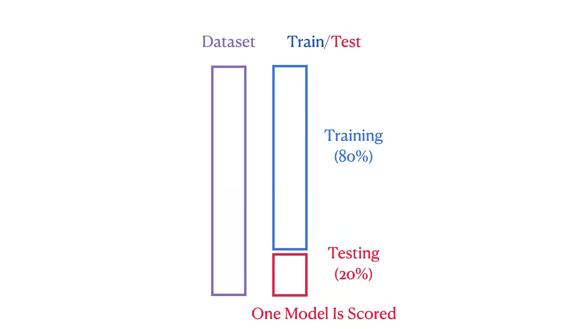
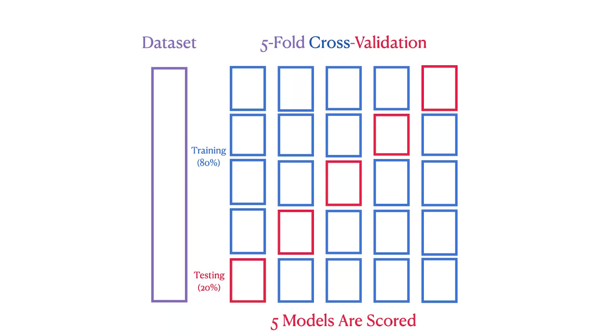
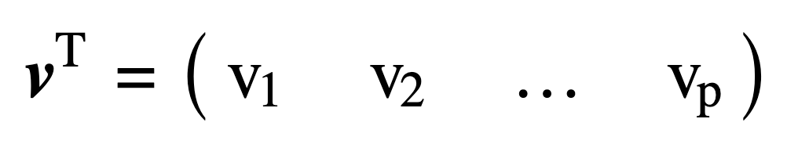
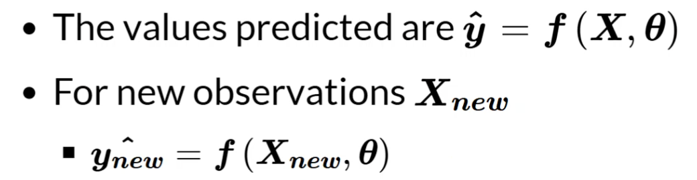
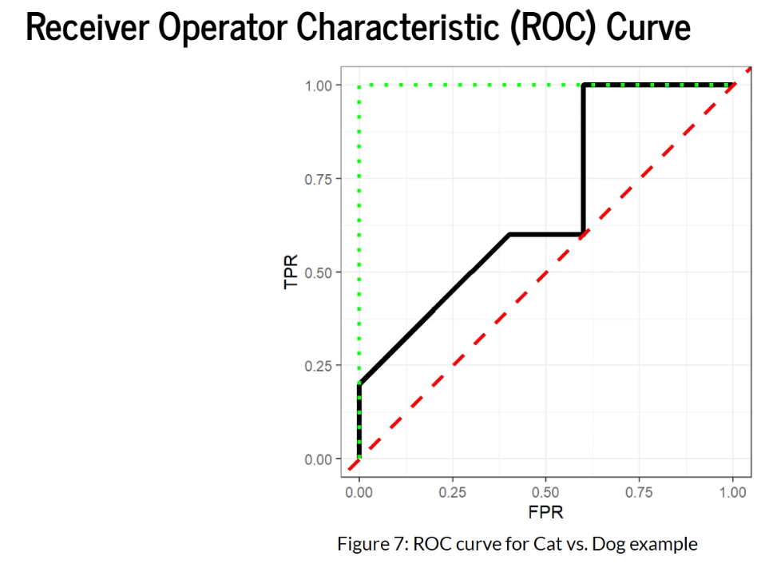
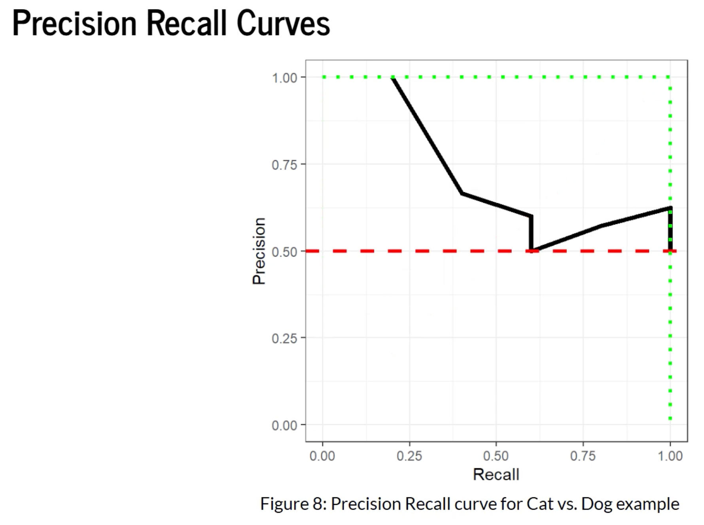

# MACHINE LEARNING Study Notes

## Some terminologies

#### **<u>Supervised Learning**</u>：
- The model learns from labeled training data
- Common superviesd learning tasks include: **Classification** and **Regression**
- For supervised learning the training data always contains labels
  - Each training data always contains labels
  - This label is a **known output** or **target value** used to guide the model's learning process
  - Labels can be **numeric 数值型**
    - When the label is numeric, the supervised learning task is usually referred to as a **Regression** problem
  - Labels can be **categorical 类别型**
    - When the label is categorical, the supervised learning task is usually referred to as a **Classification** problem, where the model's goal is to predict a **discrete category** (离散的类别)
- Model objective：to learn the relationship between **input features and output labels**，so as to make accurate predictions on new, unseen data
- Data can be anything 数据可以是任何类型 ➡️ 监督学习可以处理各种类型的输入数据
  - Numbers (数值)：e.g. age, price, measurements
  - Categories (类别)： e.g. gender, color, country
  - Images (图像)： e.g. medical imaging, satellite imagery, photographs
  - Text (文本)： e.g. reviews, articles, social media posts
- Common supervised learning algorithms:
  - **Linear & Logistic Regression**
    - Linear Regression: used for predicting continuous numeric labels
    - Logistic Regression: used for classification problems, predicting categorical labels
  - **Decision Trees & Random Forests**
    - Decision Trees: tree-like structures used for classification and regression tasks
    - Random Forests: ensembles of multiple decision trees, used to **improve the accuracy and robustness of the model**
  - **Boosting & Bagging**
    -  Boosting: an ensemble technique that **combines multiple weak classifiers to create a strong classifier** (通过组合多个弱分类器来创建一个强分类器)
    -  Bagging: an ensemble technique that **reduces variance by creating multiple copies of the training set and training multiple models** (通过创建多个训练集的副本并训练多个模型来减少方差)
  - **Support Vector Machines**
    - abbre. SVM
    - a powerful classification algorithm
    - can be used for regression (known as Support Vector Regression, SVR)
  - **Neural Networks**
    - models inspired by the structure of the human brain and can be used for various complex classification and regression tasks

#### **<u>Unsupervised Learning**</u>
- For handling unlabeled data
- Model objective：to **discover patterns and structures** in the data
- Important in **data exploration**, **pattern recognition**, and **data preprocessing**, and is widely used in customer segmentation, image segmentation, gene data analysis, etc. (在数据探索、模式识别和数据预处理等方面非常重要，广泛应用于客户细分、图像分割、基因数据分析等领域。)
- **Clusering** (divides the samples in a dataset into several groups or clusters, with **high similarity within the same cluster** and **low similarity between different clusters**)
  - **K-means**
    - Divides the data into k clusters through **iteration** (迭代)
    - Randomly selects k points as the **initial cluster centers**, assigns each sample to the **nearest cluster center**, and then **recalculates the center** of each cluster **until the cluster centers no longer change** or the preset number of iterations is reached
  - **DBScan**
    - A **density-based** clustering algorithm (基于密度的聚类算法)
    - Can discover any shape and identify noise points by **examining the neighborhood of samples to determine the cluster boundaries** (能发现任意形状的簇，识别噪声点，通过检查样本的邻域来确定簇的边界)
- **Anomaly Detection** (异常检测): Identifies samples in the dataset that significantly deviate from other data points, which are called **anomalies** (异常点) or **outliers** (离群点)
  - One class SVM
    - A variant of SVM that learns the boundary of normal data to **identify anomalies outside the boundary**. (支持向量机的变体，通过学习正常数据的边界，识别边界之外的异常点) 
    - It **maximizes the distance between normal data points and the boundary**, reducing the impact of anomalies (最大化正常数据点与边界之间的距离，减少异常点的影响)
- **Dimensionality Reduction** (Reduce the dimensionality of the data while **preserving the useful information in the data**, which is particularly important when dealing with **high-dimensional** data)
  - **PCA: Principal component analysis** (主成分分析)
    - Projects the original data onto a **new coordinate system** through **linear transformation** (通过线性变换将原始数据投影到新的坐标系中)
    - **Maximizes variance** in the data (方差最大化)
    - Calculates the **covarianze matrix** of the data (计算数据的协方差矩阵)
    - Selects the **eigenvectors with the largest variance** as the principal components (选择方差最大的几个特征向量作为主成分)


#### **<u>Semi or Self Supervised Learning</u>**
- Partially labelled training dataset
  - ∵ acquiring a large amount of labeled data is costly and time-consuming, while unlabeled data is relatively easy to obtain
- Usually combines supervised and unsupervised algorithm
- Uses labeled data to train the model and unlabeled data to discover the structure and patterns in the data
- Useful in fields such as: image recognition, natural language processing, and speech recognition
- Significantly improve the performance of the model, especially when labeled data is scarce (在标记数据稀缺的情况下，提升模型的性能)

#### **<u>Batch Learning</u>**
- A large mount of data is available at once
- Train offline and then use in production
- Takes a lot of resources and memory
- Suitable for scenarios where large amounts of data are available and real-time model updates are not required

#### **<u>Online Learning</u>**
- System trained incrementally
  - Online learning models process a small portion of data at a time and update the model gradually, instead of training on all data at once
- System continues learning during production
  - important in rapidly changing environments
  - Models can still receive and learning from new data in real-world applications
  - crucial for environments that require rapid adaptation to changes, e.g. financial markets, social media trends
- Can be used for huge datasets that cannot fit in memory at once (适用于无法一次性加载到内存的大型数据集)
  - Online learning processes data in batches, **effectively managing memory usage** and **avoiding overload**
- Need to control how fast they learn
  - Balance between learning changes quickly and forgetting old data
- Need careful monitoring of performance
  - Since models are constantly updating, their performance needs to be continuously monitored to ensure accuracy and reliability
- Suitable for handling large-scale, dynamically changing data


#### **<u>Instance Based Learning</u>**
- Also known as lazy learning or memory-based learning
- Makes predictions or classifications based on the **similarity between new instances and the training examples**
- Instead of learning a general model from the training data, instance-based learning stores the training instances and uses them directly for **inference** when new instances are encountered
  - <div style="color: grey">the training data serves as the model itself</div>
  - <div style="color: grey">the core idea: similar instances should have similar outputs or labels
  - <div style="color: grey">when a new instance is presented, the algorithm searches for the most similar instances in the training data and used their labels or values to make predictions for the new instance
- 【Key characteristics and steps involved】
  - **Instance storage**
    - The training instances, comprising feature vectors and associated labels or values, are stored in memory
    - This storage enables efficient retrieval and comparison during the prediction phase
  - **Similarity measure**
    - A similarity measure or distance metric is defined to quantify the similarity between instances
    - Common distance metrics include Euclidean distance, Manhattan distance, or cosine similarity, depending on the type of data and the problem at hand
  - **Nearest neighbor search**
    - When a new instance is presented, the algorithm searches for the nearest neighbors in the training data based on the **defined similarity measure**
    - The number of neighbors to consider, known as ***k***, is a parameter that can be set based on the problem requirements
  - **Prediction or classification**
    - Once the nearest neighbors are identified, the algorithm **assigns a prediction or label to the new instance** based on the labels or values of the nearest neighbors
    - This can involve various techniques, such as majority voting for classification tasks or weighted averaging for regression tasks**
  - **Adaptation to local data**
    - Instance-based learning allows for **adaptation to local patterns** in the data. 
    - As the training instances are stored, the algorithm can **adjust predictions** based on the distribution and characteristics of the nearest neighbors
- 【Advantages】
  - the ability to handle complex and non-linear relationships
  - the flexibility to adapt to changing data distributions
  - the potential for incremental learning (增量学习)
  - particularly useful in domains where the underlying function or decision boundaries are unknown or difficult to model explicitly (底层函数或决策边界未知或难以显式建模)
- 【Limitations】
  - can be computationally expensive <div style="color: grey"> (especially when dealing with large datasets, as it requires searching through the entire training data for each prediction)
  - is sensitive to noisy or irrelevant features, and it may struggle with high-dimensional data

#### **<u>Model Based Learning</u>**
- Also known as eager learning
- build a model from the known data
- Use the model to make **predictions** for unknown data
- When training the model usually define a **performance measure** of how good or bad it is
- If the performance is similar, we usually prefer the simple model
- This approach focuses more on **extracting general patterns or rules** from the data rather than directly using known data for prediction
- 【primarily implemented through the following steps】
  - **Building the model**: Learning from known data to construct a model, such as linear regression or decision trees
  - **Applying the model**: Using the constructed model to make predictions on unknown data
  - **Evaluating the model**: Assessing the model's performance by defining metrics like accuracy, recall, F1 score, mean squared error, etc.


---
## Reasons to use ML
- Existing solutions require extensive fine tuning: 现有解决方案需要广泛的微调
  - <div style="color: grey;">传统解决方案可能需要大量手动调整和优化才能达到满意的性能。机器学习算法能自动调整参数，减少人工干预的需求。</div>
- Problem too complex for traditional approach: 问题过于复杂，传统方法难以应对
  - <div style="color: grey;">当问题涉及大量变量、非线性关系或复杂模型时，机器学习算法，特别是深度学习，能处理这些复杂性，自动学习数据中的模式</div>
- Fluctuating Environments: 环境波动
  - <div style="color: grey;">在环境不断变化的情况下，传统静态模型可能无法适应新的条件。机器学习模型能从新的数据中学习，适应环境变化，从而保持预测的准确性</div>
    <div style="color: grey;">
    - 适应环境变化：通常指模型能随时间的推移和数据更新而调整其预测或决策，以应对外部条件或数据分布的变化。这种能力被称为模型的泛化能力或在线学习能力
    - 环境：指多种不同的外部条件或数据特征，具体包括但不限于：数据分布变化；概念漂移；非平稳性；外部事件的影响
    - 为了适应这些环境变化，机器学习模型可能需要：Online Learning在线学习; Incremental Learning增量学习; Transfer Learning迁移学习; Multi-task Learning多任务学习
- Gain insight from large amounts of data: 从大量数据中获得洞察
  - <div style="color: grey;">机器学习算法能处理/分析大量数据，从中提取有用的信息/洞察。这对于理解复杂现象、发现隐藏的关联和趋势非常有用。</div>

---

## Challenges for ML
### What affects the performance of a machine learning algorithm?
| **Reason**              | **Specific**                                                                                                                                                    |
| ----------------------- | --------------------------------------------------------------------------------------------------------------------------------------------------------------- |
| Bad data                | - not enough data </br> - not representative data </br> - poor quality </br> - poor features                                                                    |
| Not enough data         | - unreasonable effectiveness of data </br> - you never have enough data! (mroe data, mroe fine grained problems) </br> - good ML more important with small data |
| Data not representative |                                                                                                                                                                 |
| Data quality            | - bad quality data </br> - missing data                                                                                                                         |
| Bad algorithms          | - over fitting </br> - under fitting                                                                                                                            |

### **<u>Correct Features</u>**
- **Feature Selection 特征选择**
  - Features must be relevant
    - 相关性高的特征通常能更好地帮助模型进行预测
  - Must have enough features
    - 确保选择的特征数量足够，以覆盖数据的多样性和复杂性
    - 特征过少可能导致模型**欠拟合** (Under-fitting)，无法捕捉数据中的重要模式
  - Not too many irrelevant features
    - 不相关的特征无助于模型预测，还可能增加模型复杂度，导致**过拟合** (Over-fitting)
- **Feature Engineering 特征工程** 
  ➡️ 通过创建新的特征或对现有特征进行转换来提高模型性能的过程
  - Create new features
    - 根据现在数据生成新特征，这些新特征可能更好地捕捉数据中的模式。
  - Combine, split or transform
    - Combine (组合): 将多个特征组合成一个新特征。e.g.将两个数值特征相加或相乘
    - Split (分割): 将一个特征分割成多个特征。e.g.将一个包含多个信息的字符串特征分割成多个数值特征
    - Transform: 对特征进行数学转换。e.g.对数值特征取对数、平方等，以减少特征的偏态或非线性关系
  
- 通过特征选择和特征工程，可以提高模型的预测性能，减少过拟合和欠拟合的风险，并使模型更加简洁和易于解释。

---
### What can machine learning use for?
- Forecasting future revenue based on performance metrics: 基于绩效指标预测未来收入
- Calculating online insurance quotes: 计算在线保险报价
- Detecting fraudulent bank transactions: 检测欺诈性银行交易
- Segmenting clients for marketing purposes: 为营销目的进行客户细分
- Detecting tumours in medical scans: 在医学扫描中检测肿瘤
- Spam filters: 垃圾邮件过滤器
- Recommendation algorithms: 推荐算法

---
### **<u>Test Data</u>**
- Must test on unseen data before deploying algorithm
- Split data into **training** (often 70-80% ) and **test** (often 20-30% ) sets
- Don't touch test set until final algorithm created
  - <div style="color: grey; ">This helps prevent overfitting and ensures that the test set provides an unbiased evaluation of the model's performance</div>
- Use just once to measure performance of final algorithm
  - Repeated use of the test set for tuning or validation can lead to overfitting and an inaccurate assessment of the model's **generalization ability**

How do we know how the model will perform on new data if we can’t test on the test data?
Reply on **validation techniques** during development, here's how it works:
- **Cross-Validation** (e.g., k-fold):
  - Split the training data into ***k*** subsets. Train the model ***k*** times, each time using ***k*** subsets for training and ***1*** subset for validation.
  - This provides an average performance metric (e.g., accuracy, F1-score) that estimates how the model generalizes to unseen data.
  - 交叉验证是一种评估模型性能的方法。它将数据集分成多个子集（称为“折”），并在不同的子集上训练和测试模型，以确保结果的稳定性和可靠性。
- **Hold-Out Validation Set**
  - Divide the data into **training**, **validation**, and **test** sets
  - Use the validation set to **tune hyperparameters** and **monitor performance** during training
  - This mimics testing on unseen data without touching the final test set. (模拟了在不接触最终测试集的情况下对看不见的数据进行测试)
- Why Avoid the Test Set Early?
  - The test set acts as a "final exam" to evaluate the model’s **true generalization** (真实泛化能力)
  - Using it prematurely (e.g., for hyperparameter tuning) risks overfitting to the test data, inflating performance estimates (可能会过度拟合测试数据，从而夸大性能估计)
- Parameter Grid 参数网格
  - 参数网格是一个字典，其中键是模型的参数名，值是一个包含可能参数值的列表。它定义了你想要尝试的所有参数组合。
---
#### **<u>Validation data</u>** 验证数据
- Need a measure of how model will perform on unseen data before we use the test data
  - <div style="color: grey">验证集用于调整模型的参数和评估模型的性能
  - <div style="color: grey">测试集用于最终评估模型的泛化能力
- Split data again
  - Corss-validation or validation set 交叉验证或验证集
    - <div style="color: grey">将训练集分成多个小的子集，每次用一个子集作为验证集，其余子集作为训练集
    - <div style="color: grey">通过多次重复该过程以更全面地评估模型的性能
    - <div style="color: grey">从训练集中划分出一部分数据作为验证集，用于调整模型的超参数和评估模型的性能
- Use multiple times to tune algorithm 调整算法
  - The algorithm starts to learn this data too

Key Takeaway:
Validation techniques (cross-validation, hold-out validation) **provide reliable estimates** of model performance on new data, ensuring the test set remains pristine for unbiased evaluation. <div style="color: grey; ">验证技术（交叉验证、保持验证）提供了对新数据模型性能的可靠估计，确保测试集保持原始状态，以便进行无偏评估</div>

**There are 3 properties necessary for a good training and validation strategy:**
- Train the model on a large proportion of the dataset. Otherwise we’ll fail to read and recognise underlying trends in the data, resulting in underfitting. 在很大一部分数据集上训练模型。否则，我们将无法读取和识别数据中的潜在趋势，从而导致拟合不足。
- Need a good number of validation data points or we might fail to detect overfitting. 需要大量的验证数据点，否则我们可能无法检测到过拟合。
- Iterate on the training and validation process multiple times, using various training and validation dataset distributions, to be confident in validating model effectiveness properly. 使用各种训练和验证数据集分布多次迭代训练和验证过程，以确保正确验证模型的有效性。

**K-fold cross validation is a method that addresses all three**
  - Choosing K is a tradeoff; 5 and 10 are commonly used. 选择K是一种权衡；5和10是常用的
  - Disadvantage: the increased computational cost (计算成本较高，因为需进行K次训练和验证，特别是在数据集大或模型复杂的情况下)

#### **<u>K-fold cross-validation</u>  K折交叉验证** 
- It helps ensure that the model generalizes well to unseen data by using different portions of the dataset for training and testing in multiple iterations. 
- Randomly split your entire dataset into ***K*** ”folds” 将整个数据集随机拆分为K个“折叠”
- For each fold in your dataset, build your model on ***K–1*** folds of the dataset 对于数据集中的每个折叠，在数据集的K-1个折叠上构建模型
- Then, test the model to check the effectiveness for ***Kth*** fold 测试模型以检查第K次折叠的有效性
- Record the error you see on each of the predictions 记录您在每个预测中看到的错误
- Repeat this until each of the folds has served as the test set 重复此操作，直到每个fold都作为测试集
- The ***average of K recorded errors*** is called the ***cross-validation error*** and will serve as your **performance metric** for the model K个记录错误的平均值称为交叉验证错误，将作为模型的性能指标
  
【K-Fold Cross-Validation vs. Train-Test Split】
- Train-Test Split (Image by Vinod Chugani)
  - 
- K-Fold Cross-Validation (Image by Vinod Chugani)
  - 

[A Comprehensive Guide to K-Fold Cross Validation](https://www.datacamp.com/tutorial/k-fold-cross-validation)


None of the models produced in cross validation are the final model.
- <div style="color: grey">交叉验证中的模型不是最终模型，因为它们只基于部分数据训练，无法充分利用所有信息
Use the best hyper-parameters from CV
- <div style="color: grey">通过交叉验证，我们可以选择最佳的超参数，比如正则化强度或树的深度。这些超参数是在多个数据子集上表现一致的组合
- retrain on the whole training set to get your final model <div style="color: grey">确定最佳超参数后，使用这些参数在完整训练集上重新训练模型，以获得最终模型


#### **<u>Fine tuning models</u> 模型微调** 
Fine-tuning involves the process of adjusting the hyperparameters of a model to improve its performance.
- **Parameters** are learnt by the model <div style="color: grey">参数是模型在训练过程中学习到的变量。这些是模型的内部变量，通过调整来最小化损失函数
- Hyper Parameters are set by user <div style="color: grey">超参数是用户在训练过程开始之前设置的变量。这些是控制学习过程和模型结构的外部变量</div>
  - hyperparameters are not learned from the data
  - hyperparameters are the setting that are manually specified before the training process begins
  - hyperparameters control the learning process and the structure of the model
  - examples of hyperparameters: gradient descent, the number of layers in a neural network, or the max depth of a decision tree.
- Fine-tune algorithms by finding a good set of hyper-parameters
- 模型微调方法
  - 网格搜索: 系统地尝试指定范围内的所有可能的超参数组合。虽然计算成本高，但可以确保找到最佳组合。
  - 随机搜索: 从指定分布中随机采样超参数组合。计算成本较低，通常比网格搜索更高效地找到好的超参数
  - 贝叶斯优化: 使用概率模型来指导搜索最优超参数。在高维超参数空间中比网格和随机搜索更高效
  - 交叉验证: 通常与超参数调优结合使用，以确保模型性能在不同数据子集上公平且一致地评估。
- 模型微调步骤
  - 定义超参数空间: 确定要调优的超参数，并为每个超参数指定值的范围
  - 选择调优方法: 选择搜索超参数空间的方法（例如，网格搜索、随机搜索、贝叶斯优化）
  - 评估模型性能: 使用交叉验证评估每组超参数的模型性能。
  - 选择最佳超参数: 选择在验证集上表现最佳的超参数。
  - 重新训练模型: 使用最佳超参数在完整训练集上重新训练模型，以获得最终模型。

---
### **Notation**
- We use upper case bold letters for matrices, \(\mathbf{A}, \mathbf{B}, \mathbf{C}, \mathbf{X}, \ldots\)
- Matrix elements: corresponding lowercase with two indices \(a_{mq}, b_{rs}, c_{tu}, x_{ij}, \ldots\)
- for the “data matrix” or the “feature matrix” \(\mathbf{X}\)
  - \(x_{ij}\) is the element in row \(i\) and column \(j\) of the matrix \(\mathbf{X}\)
- Columns contain features / variables
  - 
- Rows contain observations
  - X = 
$$
\begin{pmatrix}
X_{11} & X_{12} & \cdots & X_{1p} \\
X_{21} & X_{22} & \cdots & X_{2p} \\
\vdots & \vdots & \ddots & \vdots \\
X_{n1} & X_{n2} & \cdots & X_{np}
\end{pmatrix}
$$


**矩阵**
- 定义: 矩阵用大写加粗字母表示，例如 A,B,C,X,…。
- 用途: 这些符号用于在数学表达式和方程中表示矩阵。矩阵是线性代数中的基本数据结构，在数据挖掘和机器学习中广泛用于表示数据、特征和变换。

**矩阵元素**
- 定义: 矩阵的元素用相应的小写字母加上两个下标表示，例如 a<sub>mq</sub>, b<sub>rs</sub>, c<sub>tu</sub>, x<sub>ij</sub> ,…
- 用途: 这些下标表示元素在矩阵中的位置。例如，a<sub>mq</sub> 表示矩阵 A 中第 m 行第 q 列的元素。这种表示法在进行矩阵运算或访问特定数据点时非常重要。

**数据矩阵或特征矩阵**
- 定义: 矩阵 X 通常用于表示数据矩阵或特征矩阵。
- 用途: 在数据挖掘和机器学习中，数据矩阵 X 通常包含数据点的特征值。矩阵 X 的每一行表示一个数据点，每一列表示一个特征。例如，x<sub>ij</sub> 是矩阵 X 中第 i 行第 j 列的元素，表示第 i 个数据点的第 j 个特征值。

- We use lower case bold letters for vectors, ***y***, ***x***
- A vector is a matrix with only
  - one row (a row vector) or,
  - one column (a column vector)
- If not specified, a vector will be a column vector
- Use italic letters for scalar values(标量值), ***i***, ***y***, ***p***
- Transpose operator(转置算子): superscript ***T***（上标T）
  - 

### **Supervised Learning Notation**
***y*** = ***f*** (***X***,***θ***) + ***ϵ***
***y***: outcome; response; label; dimensions ***n × 1***
***f***: a function
***X***: data or feature matrix, dimensions ***n × p***
***θ***: a set of “parameters”
***ϵ***: a vector of “errors” or “noise” dimensions ***n × 1***

### Inputs to training are:
- ***X*** (a feature matrix) and,
- ***y*** the values we want to predict

### During learning:
- try to find a function ***f*** and parameters ***θ***
- that give results close to ***y*** when applied to ***X*** 
- 

---
### **ML Project Structure** 

#### **Steps in an ML Project** 
- Look at the big picture
  - Objective: Understand the overall goals and context of the project
  - Activities: Define the problem statement, identify the business objectives, and set clear success metrics.
- Organise the data
- Data exploration
  - Objective: Gain insights into the data and understand its characteristics
  - Activities: Perform exploratory data analysis (EDA), visualize data distributions, and identify patterns and anomalies.
- Data wrangling (数据整理)
  - Objective: Clean and preprocess the data to make it suitable for modelling
  - Activities: Handle missing values, remove duplicates, normalize or standardize data (对数据进行归一化或标准化), and perform feature engineering.
- Select and train a model
- Fine-tune model
  - Objective: Optimize the model's performance by adjusting hyperparameters
  - Activities: Use techniques like grid search or random search to find the best hyperparameters, and validate the model's performance using the validation set
    - GridSearchCV：是scikit-learn 中的一个工具，用于自动寻找最佳参数组合。它通过遍历参数网格中的所有可能组合，找到性能最佳的参数配置。
- Present your solution
  - Objective: Communicate the model's performance and insights to stakeholders
  - Activities: Prepare a presentation or report that explains the model's performance, key insights, and business implication
- Launch, monitor and maintain model
  - Objective: Deploy the model into production and ensure it continues to perform well over time
  - Activities: Deploy the model, set up monitoring systems to track its performance, and perform regular maintenance and updates as needed

#### **Frame the solution** 
- Supervised / Unsupervised
  - 监督学习：使用带标签的数据训练模型，每个样本都有对应的输出标签，目标是学习输入特征与输出标签之间的映射关系，进行准确预测。常见任务包括分类和回归。
  - 无监督学习：使用没标签的数据，目标是发现数据中的结构和模式，常见任务包括聚类和降维。
- online / offline
  - 在线学习：模型在接收到新数据时立即更新，适用于数据流不断更新的场景，需要处理数据的顺序性和实时性。
  - 离线学习：模型在训练阶段使用整个数据集进行学习，训练完成后不再更新，适用于数据集相对静态的场景，便于管理和复现。
- classification / regression
  - 分类：预测离散的类别标签，输出是有限的类别集合。
  - 回归：预测连续的数值，输出是一个连续的数值范围。
- How will solution be used
  - 确定模型的类型和学习方式后，考虑解决方案的具体应用场景，包括模型的部署方式、用户交互方式以及模型的维护和更新策略。

#### **Performance** 
- Measure the performance
  - Select appropriate evaluation metrics based on the task type
    - For classification, use metrics like accuracy, precision, recall, and F1-score
    - For regression, use metrics like Mean Squared Error (MSE) or R-squared
- Minimum Performance
  - Set a baseline or threshold that the model must meet to be considered successful, based on business requirements or existing solutions
- Does the performance meet the business objective?
  - Ensure the model’s performance aligns with the business goals. If the model doesn’t help achieve these goals, it may not be useful despite good metrics.


#### **Data Exploration** 
- Use the TRAINING SET for exploration
- What is your validation strategy?
  - Common strategies include hold-out validation and cross-validation. This helps prevent overfitting and ensures the model generalizes well.
- Study each attribute and its characteristics
- Record your data exploration
- Study each attribute and its characteristics
  - Name, description, what does it mean? 
    - Understand the name and description of each attribute to grasp what the data represents. This is like knowing what each column in your dataset stands for.
  - Type, categorical (Does it have an order?), numerical (int/float), text, etc.
    - Identify the type of each attribute. For example, categorical data might need encoding, while numerical data might require normalization.
- Missing values
  - can affect the model's performance. Decide how to handle them, whether to impute or remove
- Noisiness and type of noise
  - Understand the type of noise in the data to decide how to clean it. For example, outliers might need to be addressed differently than random noise
- Usefulness
  - Assess whether an attribute is useful for the model. Sometimes, certain features might not contribute to the prediction and can be removed to simplify the model
- Distribution
  - Understand data distribution to choose the right model and identify any skewness (偏斜) or outliers (异常值) that might need attention
- Is it a unique identifier?
  - Identify if an attribute is a unique identifier, as such attributes usually don't provide predictive power and can be excluded from the model
- Identify target attribute/response variable (supervised learning)
  - In supervised learning, determine what you're trying to predict. This is the target variable, and all other variables are features that help in predicting it.
- Visualise the data
  - to understand patterns, relationships, and distributions
  - can be done through plots, histograms, scatter plots, etc.
- Notice any useful relationships
  - to gain insights into which features are important for the model
- Identify any useful transformations
  - transforming data (like log transformation) can improve model performance by making relationships more linear or stabilizing variance
- How would you solve this manually
  - Think about how to approach the problem without a model to provide a baseline or validate the model's predictions
- Identify any useful extra data
  - Adding more relevant data can improve model performance
  - Identify what extra data might be useful as part of the exploration process

#### **Data Wrangling** 
**Prepare the Data**
- Keep the original data intact
  - ensures that you can revert to the original data if needed and prevents data loss or corruption
- Use functions to transform the data
  - By using functions to apply the same data transformations to new data, ensuring consistency and reducing the risk of errors
  - Reproducibility
    - Functions make the data preparation process reproducible, which is crucial for debugging and validating results (函数使数据准备过程可复现，便于调试和验证结果)
  - Transferrable across projects
    - The functions and transformations can be reused in other projects, saving time and effort
  - Optimise processing as hyper parameters
    - Some data transformations can be optimized as hyperparameters, allowing you to fine-tune the data preparation process to improve model performance

**Data Cleaning**
- Outliers
  - Data collection errors (fix / remove)
    - Identify and correct/remove outliers caused by data collection errors
    - This ensures that the data is accurate and reliable
  - Are they necessary? Think back to business objectives
    - Determine if outliers are necessary for the business objectives
    - If not, consider removing to avoid skewing the analysis (避免分析结果偏差)
- Missing data
  - Drop observations
    - Remove observations with missing data if the amount of missing data is small and the data is missing completely at random (MCAR)
  - Drop features
    - Remove features with a high percentage of missing values if they are not critical to the analysis
  - Fill in values
    - Impute missing values using methods such as mean, median, mode, or more sophisticated techniques like KNN or multiple imputation
- Feature Selection
  - Select the most relevant features that contribute to the predictive power of the model, helps in reducing the dimensionality of the data and improving model performance
- Feature Engineering
  - Discretise continuous features (离散化连续特征)
    - Convert continuous features into **categorical bins** (分类区间) to capture non-linear relationships and reduce the impact of outliers
  - Decompose text, categories (分解文本、类别)
    - Break down text and categorical features into more manageable and meaningful components, such as word counts, n-grams, or one-hot encoding
  - Transform numerical (转换数值)
    - Apply transformations to numerical features to improve their distribution, such as logarithmic, square root, or reciprocal transformations
  - Aggregate (聚合)
    - Combine features to create new features that capture more complex relationships, such as sum, mean, or count aggregations
- Feature Scaling (特征缩放)
  - Scale features to ensure they are on a similar scale, which can improve the performance of many ML algorithms
    - Center / standardise / normalise: Centering (subtracting the mean) and standardizing (dividing by the standard deviation) or normalizing (scaling to a specific range) are common techniques to achieve this <div style="color: grey; ">中心化/标准化/归一化: 中心化（减去均值）和标准化（除以标准差）或归一化（缩放到特定范围）是常见的技术</div>

#### **Train the Select Models** 
- Train different models with standard parameters
  - Train various models (e.g., linear regression, decision trees, neural networks) using their default settings to establish a baseline performance
  - Assess using validation: Evaluate the models using validation techniques (e.g., cross-validation) to estimate their generalization performance on unseen data
  - Fine tune a small number of hyperparameters: Adjust a few hyperparameters to optimize model performance, focusing on key settings that can significantly improve results
- Find significant variables
  - Identify the most important features or variables that contribute to the model's predictions, enhancing model interpretability and performance
- Examine errors in models
  - to understand their limitations and areas for improvement, which can guide further adjustments
  - Try some feature selection/engineering to adjust errors
    - Refine the feature set or engineer new features based on the identified errors to better capture the underlying patterns in the data
- Select most promising model/models to fine tune
  - Focus on the models showing the most potential for further optimization, refining their hyperparameters and possibly combining them for improved performance.
- Can use a subset of data, but penalises complex models
  - Use a subset of the data during initial stages, but adjust for this by penalizing complex models to prevent overfitting

#### **Fine Tune the System** 
- Fine tune hyper parameters including preprocessing
  - Hyper Parameters
    - parameters whose values are set prior to the commencement of the learning process
    - e.g. the learning rate, the number of layers in a neural network, the depth of a decision tree, etc.
  - Preprocessing
    - involves transforming raw data into a format that is more suitable for the model to process
    - common preprocessing steps include normalization, standardization, encoding categorical variables, handling missing values, etc.
  - Fine Tuning
    - adjusting hyperparameters and preprocessing steps to optimize the model's performance
    - typically done using a validation set to evaluate the impact of different settings
- Try ensemble methods
  - Ensemble Methods
    - techniques that combine multiple models to improve the overall performance. e.g. bagging, boosting, stacking, etc.
  - Bagging
    - Reduces variance by training multiple models on different subsets of the data and averaging their predictions <div style="color: grey; ">通过在不同的数据子集上训练多个模型并对其预测进行平均来减少方差</div>
  - Boosting
    - Reduces bias by training models sequentially, where each model focuses on the errors of the previous ones
  - Stacking
    - Combines predictions from multiple models to make a final prediction, often using a meta-model to weigh the predictions
- Measure performance of final model on test dataset
  - Test Dataset
    - A portion of the data that is held back and not used during training or validation
    - It is used to provide an unbiased evaluation of the final model's performance
  - Performance Metrics
    - Depending on the task, metrics such as accuracy, precision, recall, F1 score, ROC-AUC, mean squared error, etc., are used to evaluate the model
  - Final Evaluation
    - After fine-tuning the model and possibly using ensemble methods, the final model is evaluated on the test dataset to get an estimate of its performance on unseen data

Present the solution
- Remember big picture from step 1
- How the model meets business objective
- Describe interesting findings along the way
  - Limitations and assumptions
  - Document best solution in detail
  - Briefly describe what solutions were rejected and why.
- Present clear statements and/or visuals of key findings

### **Fine Tune the System** 
#### **<u>Regression</u>**
- Regression is predicting a number.
- We could calculate the sum of the differences between the real and predicted values
  - Real value \( y_i \) (实际值)
  - Predicted value = \( \hat{y}_i \) (预测值)
  - n: 样本数量
  - \( \sum_{i=1}^{n} (y_i - \hat{y}_i) \)
- Sum of value squared \(\sum_{i=1}^{n} \left(y_{i} - \hat{y}_{i} \right)^{2}\)
  - Residual sum of squares (RSS)
  - Sum of square errors (SSE)
- Sum of absolute values \(\sum_{i=1}^{n} \left|y_{i} - \hat{y}_{i} \right|\)
 
- <mark>**MSE</mark> = <mark>\( \frac{1}{n} \sum_{i=1}^{n} \left(y_{i} - \hat{y}_{i} \right)^{2} \)**</mark>  ➡️ Mean Squared Error 均方误差
  - 作用：用于<mark>衡量模型的预测精度，值越小说明模型预测越准确<mark>
- <mark>**RMSE</mark> = <mark>\( \sqrt{\frac{1}{n} \sum_{i=1}^{n} \left(y_{i} - \hat{y}_{i} \right)^{2}} \)**</mark>  ➡️  
    - Root Mean Square Error (RMSE), 均方根误差, 是回归模型评估的核心指标之一
- MSE 和 RMSE 都涉及误差的平方，因此对异常值（即远离平均值的点）非常敏感。异常值会导致误差平方增大，从而显著影响 MSE 和 RMSE 的值
- RMSE 是通过取 MSE 的平方根，将误差值转换到与原始数据相同的量纲上，从而便于理解和比较误差的大小
 
- <mark>**Euclidean norm, \( L_2 \) norm, \( ||\cdot||_2 \)**</mark>
  - \( L_2 \) 范数：数学上对欧几里得范数的另一种称呼，定义为向量各元素平方和的平方根
  - Euclidean norm (欧几里得范数) ➡️ The Euclidean norm is the square root of the sum of the squares of the vector elements, used to measure the length or magnitude of a vector <div style="color: grey;">向量空间中向量长度的计算公式 （如向量的几何距离</div>
  - 在机器学习中的应用
    - 用于<mark>正则化（如岭回归），防止模型过拟合</mark>
    - <mark>RMSE本质上利用了\( L_2 \) 范数计算误差</mark>
- Outliers have more influence
 
- <mark>**MAE</mark> = <mark>\(\frac{1}{n}\sum_{i=1}^{n} \left|y_{i} - \hat{y}_{i} \right|\)**</mark>
- MAE: Mean Absolute Error  (平均绝对误差)
- MAE 是预测误差的绝对值的平均值，能够反映预测值与实际值之间的平均绝对差
 
- <mark>**Manhattan norm, \( L_1 \) norm, \( ||\cdot||_1 \)**</mark>
- The Manhattan norm is the sum of the absolute values of the vector elements, used to measure the length or magnitude of a vector <div style="color: grey;">曼哈顿范数是向量元素绝对值的和，用于衡量向量的长度或大小</div>
- In error metric, the Manhattan norm corresponds to MAE <div style="color: grey;">在误差度量中，曼哈顿范数对应于 MAE
- Since MAE involves only the absolute values or errors, not their squares, it is less sensitive to outliers. Outliers do not significantly increase the value of MAE because MAE does not amplify errors <div style="color: grey;">由于 MAE 只涉及误差的绝对值，而不是平方值，因此对异常值的敏感度较低。异常值不会显著增加 MAE 的值，因为 MAE 不会放大误差

- <mark>**SSE (Sum of Squares due to Error)**</mark> 残差平方和
  - \[ SSE = \sum_{i=1}^{n} (y_i - \hat{y}_i)^2 \]
  - 观测值与模型预测值之间差异的平方和
- <mark>**SSR (Sum of Squares due to Regression)**</mark> 回归平方和
  - \[ SSR = \sum_{i=1}^{n} (\hat{y}_i - \bar{y})^2 \]
  - 预测值与观测值平均值之间差异的平方和
- <mark>**SST (Total Sum of Squares)**</mark> 总平方和
  - \[ SST = \sum_{i=1}^{n} (y_i - \bar{y})^2 \]
  - \[ SST = SSR + SSE \]
  - 观测值与观测值平均值之间差异的平方和
- <mark>**\( R^2 \)**</mark> ：R squared (决定系数)
  - 是回归平方和与总平方和的比率，表示模型解释的变异量占总变异量的比例
  - \[ R^2 = \frac{SSR}{SST} \]
  - \( R^2 = 1 - \frac{SSE}{SST} = 1 - \frac{\sum_{i=1}^{n} \left(y_{i} - \hat{y}_{i} \right)^2}{\sum_{i=1}^{n} \left(y_{i} - \bar{y} \right)^2} \)
  - Sum of squares total (SST), \( \sum_{i=1}^{n} \left(y_{i} - \bar{y} \right)^2 \)
  - SSE: 残差平方和； SST: 总平方和
  - \( y_i \) 是第i个观测值。
  - \( \hat{y}_i \) 是第i个预测值。
  - \( \bar{y} \) 是观测值的平均值。
  - \( n \) 是观测值的数量。
  - Coefficient of multiple determination
  - \( R^2 \) 用于评估回归模型的拟合优度
  - \( R^2 \) 是一个介于 0 和 1 之间的值，表示模型解释的变异量占总变异量的比例。值越接近 1，表示模型拟合得越好，即模型能够更好地解释因变量的方差
  - \( R^2 \) 局限性，例：不能区分模型的预测值与实际观测值之间的线性关系和非线性关系


---
### **Classification**
- Classification can either be
  - binary (2 classes)
  - multiclass (more than 2 classes)
- Some methods of measuring performance can be used for both
  - Some are either binary only or multiclass only
- First we look at methods that can be used for either

#### **<u>Confusion Matrix</u>**
- Can be any number of classes
- Do not need to be ordered (low, med, high)

##### Accuracy
- The percentage of correct answers
- <mark>**Accuracy = \( \frac{correct}{total} \)**</mark>
  
#### **<u>Binary Classification</u>**
- Only two categories
- Predict positive, actual class positive, true positive, \(TP\)
- Predict positive, actual class negative, false positive, \(FP\), type I errors
- Predict negative, actual class negative, true negative, \(TN\)
- Predict negative, actual class positive, false negative, \(FN\), type II errors

<mark>**Accuracy = \( \frac{TP+TN}{TP+FP+FN+TN} \)**</mark>

<mark>**Recall = \( \frac{TP}{TP+FN} \)**</mark>
- Recall, also known as:
  - Sensitivity
- Hit rate
- True Positive Rate (TPR)
- Percent of actual positives that are correct <div style="color: grey;"> 召回率是指在所有实际为正类的样本中，被模型正确识别的比例。
- Higher recall indicates fewer false negatives <div style="color: grey;">召回率越高，表示模型的漏报（False Negatives）越少

<mark>**Precision = \( \frac{TP}{TP+FP} \)**</mark>
- Precision, also known as:
  - Positive Predictive Value (PPV)
- Percentage of positive predictions that are correct
- Precision is the proportion of correctly identifies positive samples among all samples identified as positive by the model <div style="color: grey; ">精确率是指在所有被模型正确识别为正类的样本中，实际为正类的比例<div>
- Higher precision indicates fewer false positives <div style="color: grey; ">精确率越高，表示模型的误报（False Positives）越少

<mark>**Specificity = \( \frac{TN}{TN+FP} \)**</mark>
- Specificity, also known as:
  - Selectivity
  - True Negative Rate (TNR)
- Percent of actual negatives that are correct
- False Positive Rate = \( \frac{FP}{TN+FP} \)
- False Positive Rate, also known as:
  - Fall out
  - Probability of false alarm
- Percent of actual negatives that are incorrect

<mark>**\( F_1 \) score**</mark>
<mark>**\( F_1 = 2 \times \frac{\text{precision} \times \text{recall}}{\text{precision} + \text{recall}} \)**</mark>
- Harmonic mean of precision and recall ➡️ ensure that the model performs well on both metrics <div style="color: grey; "> 精确度和召回率的调和平均值, 以评估模型的整体性能</div>
- F1 是在分类问题中常用的评估指标，特别是在需要同时考虑 precision 和 recall 的情况下
- F1 attempts to balance these two metrics to evaluate the overall performance of the model <div style="color: grey; ">试图在precision和recall两个指标间找到平衡，以评估模型的整体性能</div>
- Needs high precision and recall
  
  
The output types of a binary classifier
- Predictions
- Scores

<mark>**Predictions**</mark>
- Refer to the classifier directly outputting a class label <div style="color: grey; ">分类器直接输出一个类别标签</div>
- For binary classification problems, the output is typically "True" or "False", "Yes" or "No", "0" or "1" <div style="color: grey; ">对于二元分类问题，输出通常是“是”或“否”、“真”或“假”、“0”或“1”</div>
- Suitable for scenarios where a clear classification result is needed, such as spam email detection (spam/non-spam)<div style="color: grey; ">适用于需要明确分类结果的场景，例如垃圾邮件检测（垃圾邮件/非垃圾邮件）</div>

<mark>**Scores**</mark>
- Refers to the classifier outputting a **continuous value** representing the **probability** or **confidence** that a sample belongs to a certain class<div style="color: grey; ">分数是指分类器输出一个连续值，表示样本属于某一类别的概率或置信度
- The range of scores can be from **negative infinity** to **positive infinity**, or from **0 to 1**. For example, logistic regerssion models typically output a probability value between 0 and 1<div style="color: grey; ">分数的范围可以是从负无穷到正无穷，或者从0到1。例如，逻辑回归模型通常会输出一个介于0和1之间的概率值
- Suitable for scenarios where the confidence of classification is needed, or where scores need further processing, such as setting a threshold for classfication <div style="color: grey; ">这种输出方式适用于需要了解分类置信度的场景，或者需要进一步处理分数的情况，如设置阈值进行分类

<mark>**Receiver Operator Characteristic (ROC) Curve**</mark>
 
This graph shows a Receiver Operating Characteristic (ROC) curve, which is a common method for evaluating the performance of a binary classification model. The graph displays the ROC curve for a cat versus dog classification example. In this graph:
- **X-axis** 
  - represents the False Positive Rate
  - the proportion of negative instances incorrectly predicted as positive<div style="color: grey; ">假阳性率，错误地将负类预测为正类的比例</div>
- **Y-axis** 
  - represents the True Positive Rate, also is "Recall"
  - the proportion of positive instances correctly predicted as positive <div style="color: grey; ">真阳性率，正确地将正类预测为正类的比例</div>
- **Performance Evaluation**（性能评估）
  - The area under the ROC curve (Area Under the Curve, AUC) is an important metric for evaluating model performance. 
  - The AUC value ranges from 0 to 1, with higher values indicating better model performance.<div style="color: grey; ">AUC的值介于0和1之间，值越大，模型的性能越好</div>
  - In this example, the model's ROC curve is significantly above the baseline of random guessing, indicating good discriminative ability.<div style="color: grey; ">在这个例子中，模型的ROC曲线明显高于随机猜测的基线，表明模型具有较好的区分能力</div>
- **Threshold Selection**（阈值选择）
  - Different points on the ROC curve correspond to different classification thresholds. <div style="color: grey; ">ROC曲线上的不同点对应于不同的分类阈值</div>
  - By adjusting the threshold, a trade-off can be made between FPR and TPR to find the optimal classification strategy <div style="color: grey; ">通过调整阈值，可以在FPR和TPR之间进行权衡，以找到最佳的分类策略</div>
- **Black Line** 
  - represents the model's performance
  - represents the actual ROC curve of the classifier being evaluated. <div style="color: grey; ">代表了正在评估的分类器的实际ROC曲线</div>
  - It plots the True Positive Rate (TPR) against the False Positive Rate (FPR) at various threshold settings. <div style="color: grey; ">绘制了在不同阈值设置下真正率（TPR）与假正率（FPR）之间的关系</div>
  - The closer this curve follows the left-hand border and then the top border of the ROC space, the more accurate the classifier.<div style="color: grey; ">这条曲线越接近ROC空间的左边界和上边界，分类器的准确性就越高，即模型的分类性能越好</div>
- **<div style="color: green; ">Green Dotted Line</div>**   
  - represents a threshold that results in a TPR equal to the FPR. <div style="color: grey; ">某个特定阈值下真正率等于假正率的点</div>
  - It's a line of no discrimination, meaning the classifier is performing no better than random guessing at this point. <div style="color: grey; ">这是一条无区分能力的线，意味着在这个点上分类器的性能不比随机猜测好。</div>
  - In essence, it's where the classifier's predictions are as likely to be false positives as true positives.<div style="color: grey; ">本质上，这是分类器的预测假阳性和真阳性可能性相同的点。</div>
- **<div style="color: red; ">Red Dashed Line</div>** 
  - the diagonal line from the bottom left to the top right of the ROC space, representing a completely random classifier where the TPR is equal to the FPR at every point. <div style="color: grey; ">从ROC空间的左下角到右上角的对角线，代表一个完全随机的分类器，其中在每个点上TPR都等于FPR</div>
  - A classifier with an ROC curve that lies below this line is considered to perform worse than random guessing. <div style="color: grey; ">如果一个分类器的ROC曲线位于这条线下方，则认为其性能比随机猜测还差</div>


<mark>**Precision Recall (PR) Curves**</mark>


曲线越靠近右上角（Precision=1，Recall=1），模型性能越好。(模型在保持高召回率的同时，也能维持较高的精确率)

<mark>**Area Under the Curve (AUC)**</mark>
- AUC refers to the area under the ROC curve or the PR curve. 
- It represents the model's ability to correctly classify positive and negative samples.
- An important metric for evaluating the performance of classification models
- How to read AUC？
  - The AUC value ranges from 0 to 1
  - **1**: the model can perfectly distinguish between positive and negative samples
  - **Closer to 1**: the better the model's classification performance
  - **0.5**: indicates that the model's classification performance is equivalent to random guessing
  - **Less than 0.5**: indicates that the model's classification performance is worse than random guessing
  - For precision-recall curves, the AUC for a random classifier depends on the proportion of positive samples in the overall sample. This is because, under random guessing, the model's precision and recall will be related to the proportion of positive samples <div style="color: grey; ">对于精确率-召回率曲线，随机分类器的AUC值取决于正类样本在总体样本中的比例。这是因为在随机猜测的情况下，模型的精确率和召回率将与正类样本的比例相关</div>
.

#### **<u>Multiclass</u>**
- Split into multiple binary problems
- Take an average or weighted average of binary measures
- ***One-vs-Rest*** also called ***One-vs-All***
  - Decompose a multiclass problem into multiple binary problems
  - Each class is calculated as 【**that class**】vs.【**not that class**】
  - For example, with low, medium, and high classes:
    - 【low】vs.【not low (medium and high)】
    - 【medium】vs.【not medium (low and high)】
    - 【high】vs.【not high (low and medium)】
  - <mark>**For N classes, N binary problems**</mark>
- ***One-vs-One***
  - Split into each class vs each class ➡️ Decompose a multiclass problem into binary problems between each pair of classes
  - For example, with low, medium, and high classes:
    - 【low】vs.【medium】
    - 【low】vs.【high】
    - 【medium】vs.【high】
  - <mark>**For N classes, \( \frac{N\times(N-1)}{2}\) binary problems**</mark>
  - One-vs-One requires more calculations (than One-vs-Rest) because more binary models are created


---
### PREPROCESSING
#### Empty Cells
- Returen a new Data Frame with no empty cells
  - `df.dropna()`
  ```
  df = pd.read_csv('data.csv')
  new_df = df.dropna()
  print(new_df.to_string())
  ```


---
### LINEAR REGRESSION AND MODEL TRAINING
`lr.fit`：scikit-learn 库中Linear Regression的一个方法，用于训练模型，使其能够根据输入数据预测输出
- 作用：找到最佳的模型参数，使得模型能够最好地拟合训练数据
  - e.g.在线性回归中，模型的参数是直线的斜率（slope）和截距（intercept），lr.fit 的任务就是找到这些参数的最佳值
- 拟合过程：模型会尝试调整这些参数，使得预测值和实际值之间的误差最小
  - 这个误差通常用“损失函数”（Loss Function）来衡量，比如均方误差（Mean Squared Error, MSE）
- 最佳拟合
  -  lr.fit 使用优化算法（如梯度下降）来找到使损失函数最小的参数组合
  -  这个过程可以想象成在参数空间中寻找最低点
#### StandardScaler
- StandardScaler 是 scikit-learn 库中的一个类，用于标准化数据
- 主要作用：将数据的每个特征（列）转换为均值为 0、标准差为 1 的分布
- 标准化的目的
  - 统一尺度
    - 不同特征的数值范围可能差异很大（例如，房屋面积可能在 10 到 1000 之间，而价格可能在 100000 到 1000000 之间）。标准化可以消除这种尺度差异，使所有特征在相同的尺度上。
  - 提高模型性能
    - 许多机器学习算法（如线性回归、支持向量机等）对特征的尺度敏感。标准化可以提高这些算法的收敛速度和性能。
- 标准化的目的：消除特征之间的尺度差异，提高模型性能。
- 标准化的影响：可能会改变模型中不同系数的重要性。
- **Z分数**：一种标准化方法，它将数据转换成一个均值为0、标准差为1的分布
  - <mark>**\( Z = \frac{X - \mu}{\sigma} \)**<mark> 
- 标准化的过程
  - 计算每个特征的均值和标准差
  - 将每个数据点的特征值减去均值，除以标准差，即得到标准化后的数据
  - 标准化后的数据的均值为 0，标准差为 1
  - 这样所有特征就处于相同的尺度上，方便模型训练和比较，提高模型性能
- 为什么需要标准化？（通俗理解）
  - 假设你有两个朋友，一个叫小明，一个叫小红。小明的数学考试满分是100分，他考了90分；小红的语文考试满分是200分，她考了180分。现在你想知道谁考得更好。直接比较原始分数的话，小红的180分看起来比小明的90分高很多。但实际上，小明的90分是满分的90%，而小红的180分是满分的90%。他们的表现其实是相同的。标准化就是把不同尺度的数据（比如不同满分的考试成绩）转换成一个统一的尺度（比如百分比），这样比较起来就公平了。
- 为什么标准化可以提高算法的收敛速度和性能？
  - 想象你在爬山，想找到山顶。如果你的步子大小不一（特征尺度不同），你可能会在某些方向上迈得太大，在另一些方向上迈得太小，导致你绕了很多弯路才找到山顶。而如果你的步子大小一致（特征尺度统一），你就能更直接地找到山顶。在机器学习中，标准化就像是让所有特征的“步子”大小一致，这样模型在学习时可以更快地找到最佳解，减少迭代次数，提高效率。   

#### XGBoost
- XGBoost：是一种基于梯度提升的机器学习算法，它通过构建多个决策树来提高预测的准确性和性能。
- XGBRegressor：XGBRegressor 是 XGBoost 库中专门用于回归问题的类。
- 通过构建多个决策树逐步修正预测错误，预测性能强大，但解释性较差。
- 可以处理缺失值和非数值列，无需标准化。
- XGBRegressor 的主要参数
  - n_estimators：决策树的数量。默认值为 100(通常从100开始，逐步增加)。➡️ 增加树的数量通常可以提高模型的性能，但过多的树可能会导致过拟合。
  - learning_rate：学习率，控制每棵树对最终结果的贡献程度。默认值为 0.1(通常从0.01开始，逐步增大)。➡️ 较小的学习率可以使模型更稳定，但可能需要更多的树来收敛。
  - max_depth：每棵树的最大深度。默认值为 3(通常从3开始，逐步增加)。➡️ 较大的深度可以使模型更复杂，但也可能导致过拟合。
  - subsample：用于训练每棵树的样本比例。默认值通常从0.7开始，逐步增大。➡️ 减少样本比例可以防止过拟合。
  - colsample_bytree：用于训练每棵树的特征比例。默认值通常从0.7开始，逐步增大。➡️ 减少特征比例可以防止过拟合。
  - random_state：随机种子，用于确保结果的可重复性。
- XGBRegressor 的优势
  - 高准确性：通过构建多个决策树，逐步修正预测错误，提高模型的准确性。
  - 高效性：XGBoost 使用高效的算法和数据结构，能够快速处理大规模数据。
  - 灵活性：支持多种参数调整，可以根据具体问题进行优化。
  - 鲁棒性：对缺失值和异常值具有较好的鲁棒性。
