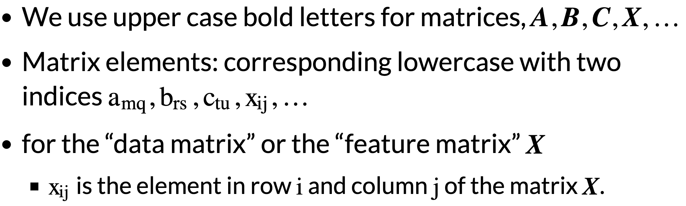
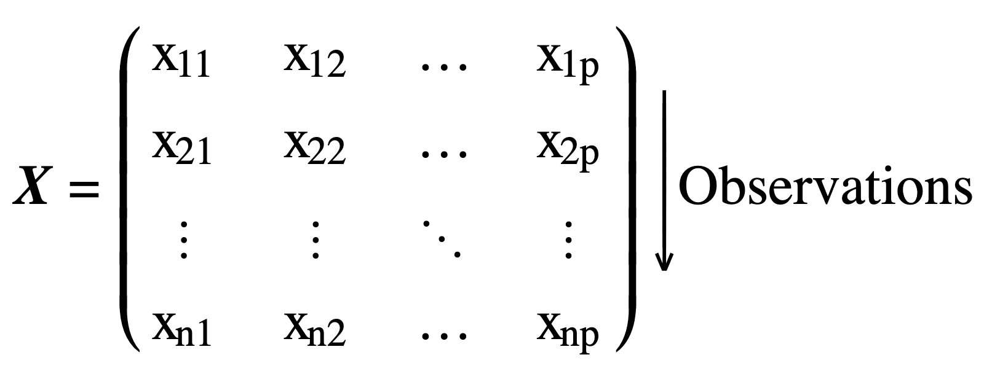

# MACHINE LEARNING Study Notes

---
## Some terminologies

| **_Supervised Learning_**       | **_Unsupervised Learning_**                                |
| ------------------------------- | ---------------------------------------------------------- |
| Linear & Logistic Regression    | **Clustering:** k-means; DBScan                            |
| Decision trees & Random Forests | **Anomaly Detection:** one class SVM                       |
| Boosting & Bagging              | **Dimensionality Reduction:** Principal component analysis |
| Support Vector Machines         |                                                            |
| Neural Networks                 |                                                            |  | Dimensionality Reduction - Principal component analysis |

- 监督学习：模型从标记的训练数据中学习，即每个训练样本都有一个与之对应的输出标签。模型的目标是学习输入特征和输出标签之间的关系，以便能够对新的、未见过的数据做出准确的预测。常见的监督学习任务包括**分类**和**回归**。
- 无监督学习：模型处理的是未标记的数据，即没有明确的输出标签。模型的目标是**发现数据中的结构和模式**，如聚类或降维。无监督学习常用于探索性数据分析和特征学习。

**Semi or Self Supervised Learning**
- Partially labelled data
- Usually combines supervised and unsupervised algorithm

**Batch Learning**
- A large mount of data is available at once
- Train offline and then use in production
- Takes a lot of resources and memory

**Online Learning**
- System trained incrementally
- System continues learning during production
  - important in rapidly changing environments
- Can be used for huge datasets that cannot fit in memory at once
- Need to control how fast they learn
  - Balance between learning changes quickly and forgetting old data
- Need careful monitoring of performance

**批量学习**：模型在训练阶段一次性处理整个训练数据集。训练完成后，模型参数固定，不再更新，直到下一次重新训练。这种方法适用于**数据集大小适中且数据分布稳定**的情况。

**在线学习**：在接收到新数据时即时更新。这种方法适用于**数据流或实时应用**，其中数据不断到来，模型需要**快速适应新信息**。

**Instance Based Learning**
- Learn the known data
- Measure similarity of new data to known data
- Assign value of closet known data to new data

**Model Based Learning**
- In this we build a model from the known data
- Use the model to make **predictions** for unknown data
- When training the model usually define a **performance measure** of how good or bad it is
- If the performance is similar, we usually prefer the simple model

**实例学习**：也称<u>懒惰学习 lazy learning</u>，模型不从训练数据中学习一个明确的函数或模型，而是将训练数据实例存储起来。在预测新数据时，模型通过查找与新数据最相似的训练实例来进行预测。这种方法适用于**数据集较小且计算资源有限**的情况。

**模型学习**：也称<u>急切学习 eager learning</u>，模型在训练阶段从数据中学习一个预测函数或模型。这个模型可以是一个决策树、神经网络或其他算法。在预测新数据时，模型直接使用这个函数或模型进行预测。这种方法适用于**数据集较大且需快速预测**的情况。

---

## Reasons to use ML
- Existing solutions require extensive fine tuning: 现有解决方案需要广泛的微调
  - 
传统解决方案可能需要大量手动调整和优化才能达到满意的性能。机器学习算法能自动调整参数，减少人工干预的需求。

- Problem too complex for traditional approach: 问题过于复杂，传统方法难以应对
  - 
当问题涉及大量变量、非线性关系或复杂模型时，机器学习算法，特别是深度学习，能处理这些复杂性，自动学习数据中的模式

- Fluctuating Environments: 环境波动
  - 
在环境不断变化的情况下，传统静态模型可能无法适应新的条件。机器学习模型能从新的数据中学习，适应环境变化，从而保持预测的准确性

    

    - 适应环境变化：通常指模型能随时间的推移和数据更新而调整其预测或决策，以应对外部条件或数据分布的变化。这种能力被称为模型的泛化能力或在线学习能力
    - 环境：指多种不同的外部条件或数据特征，具体包括但不限于：数据分布变化；概念漂移；非平稳性；外部事件的影响
    - 为了适应这些环境变化，机器学习模型可能需要：Online Learning在线学习; Incremental Learning增量学习; Transfer Learning迁移学习; Multi-task Learning多任务学习
- Gain insight from large amounts of data: 从大量数据中获得洞察
  - 
机器学习算法能处理/分析大量数据，从中提取有用的信息/洞察。这对于理解复杂现象、发现隐藏的关联和趋势非常有用。

---

## Challenges for ML
### What affects the performance of a machine learning algorithm?
| **Reason**              | **Specific**                                                                                                                                                    |
| ----------------------- | --------------------------------------------------------------------------------------------------------------------------------------------------------------- |
| Bad data                | - not enough data   - not representative data   - poor quality   - poor features                                                                    |
| Not enough data         | - unreasonable effectiveness of data   - you never have enough data! (mroe data, mroe fine grained problems)   - good ML more important with small data |
| Data not representative |                                                                                                                                                                 |
| Data quality            | - bad quality data   - missing data                                                                                                                         |
| Bad algorithms          | - over fitting   - under fitting                                                                                                                            |

### Correct Features
- **Feature Selection 特征选择**
  - Features must be relevant
    - 相关性高的特征通常能更好地帮助模型进行预测
  - Must have enough features
    - 确保选择的特征数量足够，以覆盖数据的多样性和复杂性
    - 特征过少可能导致模型**欠拟合**，无法捕捉数据中的重要模式
  - Not too many irrelevant features
    - 不相关的特征无助于模型预测，还可能增加模型复杂度，导致**过拟合**
- **Feature Engineering 特征工程** 
  ➡️ 通过创建新的特征或对现有特征进行转换来提高模型性能的过程
  - Create new features
    - 根据现在数据生成新特征，这些新特征可能更好地捕捉数据中的模式。
  - Combine, split or transform
    - Combine组合: 将多个特征组合成一个新特征。e.g.将两个数值特征相加或相乘
    - Split分割: 将一个特征分割成多个特征。e.g.将一个包含多个信息的字符串特征分割成多个数值特征
    - Transform: 对特征进行数学转换。e.g.对数值特征取对数、平方等，以减少特征的偏态或非线性关系
  
- 通过特征选择和特征工程，可以提高模型的预测性能，减少过拟合和欠拟合的风险，并使模型更加简洁和易于解释。

---
### What can machine learning use for?
- Forecasting future revenue based on performance metrics: 基于绩效指标预测未来收入
- Calculating online insurance quotes: 计算在线保险报价
- Detecting fraudulent bank transactions: 检测欺诈性银行交易
- Segmenting clients for marketing purposes: 为营销目的进行客户细分
- Detecting tumours in medical scans: 在医学扫描中检测肿瘤
- Spam filters: 垃圾邮件过滤器
- Recommendation algorithms: 推荐算法

---
### Test Data
- Must test on unseen data before deploying algorithm
- Split data into **training** and **test** sets (often 80% + 20% )
- Don't touch test set until final algorithm created
- Use just once to measure performance of final algorithm 

How do we know how the model will perform on new data if we can’t test on the test data?

### Validation data 验证数据
- Need a measure of how model will perform on unseen data before we use the test data
- Split data again
  - Corss-validation or validation set 交叉验证或验证集
- Use multiple times to tune algorithm 调整算法
  - The algorithm starts to learn this data too

**There are 3 properties necessary for a good training and validation strategy:**
- Train the model on a large proportion of the dataset. Otherwise we’ll fail to read and recognise underlying trends in the data, resulting in underfitting. 在很大一部分数据集上训练模型。否则，我们将无法读取和识别数据中的潜在趋势，从而导致拟合不足。
- Need a good number of validation data points or we might fail to detect overfitting. 需要大量的验证数据点，否则我们可能无法检测到过拟合。
- Iterate on the training and validation process multiple times, using various training and validation dataset distributions, to be confident in validating model effectiveness properly. 使用各种训练和验证数据集分布多次迭代训练和验证过程，以确保正确验证模型的有效性。

**K-fold cross validation is a method that addresses all three**
  - Choosing K is a tradeoff; 5 and 10 are commonly used. 选择K是一种权衡；5和10是常用的
  - The disadvantage is the increased computational cost. 计算成本增加

**K-fold cross-validation  K折交叉验证** 
- Randomly split your entire dataset into K ”folds” 将整个数据集随机拆分为K个“折叠”
- For each fold in your dataset, build your model on K–1 folds of the dataset 对于数据集中的每个折叠，在数据集的K-1个折叠上构建模型
- Then, test the model to check the effectiveness for Kth fold 测试模型以检查第K次折叠的有效性
- Record the error you see on each of the predictions 记录您在每个预测中看到的错误
- Repeat this until each of the folds has served as the test set 重复此操作，直到每个fold都作为测试集
- The average of your K recorded errors is called the cross-validation error and will serve as your performance metric for the model K个记录错误的平均值称为交叉验证错误，将作为模型的性能指标

---
- None of the models produced in cross validation are the final model.
- Use the best hyper parameters from CV
  - retrain on the whole training set to get your final model

---
**Fine tuning models**
Fine-tuning involves the process of adjusting the hyperparameters of a model to improve its performance.
- **Parameters** are learnt by the model
- Hyper Parameters are set by user
  - **hyperparameters** are not learned from the data
  - **hyperparameters** are the setting that are manually specified before the training process begins
  - **hyperparameters** control the learning process and the structure of the model
  - **examples of hyperparameters**: gradient descent, the number of layers in a neural network, or the max depth of a decision tree.
- Fine tune algorithms by finding a good set of hyper parameters

---

### **Notation**
- 
- Columns contain features / variables
  - 
- Rows contain observations
  - 
- We use lower case bold letters for vectors, ***y***, ***x***
- A vector is a matrix with only
  - one row (a row vector) or,
  - one column (a column vector)
- If not specified, a vector will be a column vector
- Use italic letters for scalar values(标量值), ***i***, ***y***, ***p***
- Transpose operator(转置算子): superscript ***T***（上标T）
  - 

### **Supervised Learning Notation**
***y*** = ***f*** (***X***,***θ***) + ***ϵ***
***y***: outcome; response; label; dimensions n * 1
***f***: a function
***X***: data or feature matrix, dimensions n * p

### Inputs to training are:
- ***X*** (a feature matrix) and,
- ***y*** the values we want to predict

### During learning:
- try to find a function ***f*** and parameters ***θ***
- that give results close to ***y*** when applied to ***X*** 
- 

### Train a Model
- Measure performance

