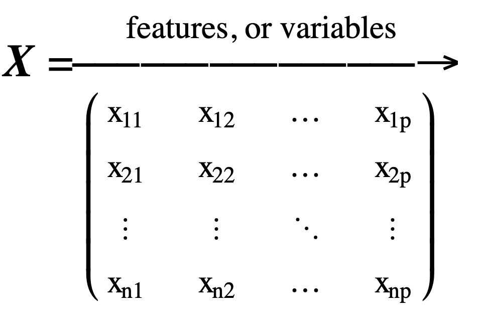

# MACHINE LEARNING Study Notes

---
## Some terminologies

| **_Supervised Learning_**       | **_Unsupervised Learning_**                                |
| ------------------------------- | ---------------------------------------------------------- |
| Linear & Logistic Regression    | **Clustering:** k-means; DBScan                            |
| Decision trees & Random Forests | **Anomaly Detection:** one class SVM                       |
| Boosting & Bagging              | **Dimensionality Reduction:** Principal component analysis |
| Support Vector Machines         |                                                            |
| Neural Networks                 |                                                            |  | Dimensionality Reduction - Principal component analysis |

**Semi or Self Supervised Learning**
- Partially labelled data
- Usually combines supervised and unsupervised algorithm

**Batch Learning**
- A large mount of data is available at once
- Train offline and then use in production
- Takes a lot of resources and memory

**Online Learning**
- System trained incrementally
- System continues learning during production
  - important in rapidly changing environments
- Can be used for huge datasets that cannot fit in memory at once
- Need to control how fast they learn
  - Balance between learning changes quickly and forgetting old data
- Need careful monitoring of performance

**Instance Based Learning**
- Learn the known data
- Measure similarity of new data to known data
- Assign value of closet known data to new data

**Model Based Learning**
- In this we build a model from the known data
- Use the model to make **predictions** for unknown data
- When training the model usually define a **performance measure** of how good or bad it is
- If the performance is similar, we usually prefer the simple model

---

## Challenges for ML
### What affects the performance of a machine learning algorithm?
| **Reason**              | **Specific**                                                                                                                                                    |
| ----------------------- | --------------------------------------------------------------------------------------------------------------------------------------------------------------- |
| Bad data                | - not enough data   - not representative data   - poor quality   - poor features                                                                    |
| Not enough data         | - unreasonable effectiveness of data   - you never have enough data! (mroe data, mroe fine grained problems)   - good ML more important with small data |
| Data not representative |                                                                                                                                                                 |
| Data quality            | - bad quality data   - missing data                                                                                                                         |
| Bad algorithms          | - over fitting   - under fitting                                                                                                                            |

### Correct Features
- Feature Selection
  - Features must be relevant
  - Must have enough features
  - Not too many irrelevant features
- Feature Engineering
  - Create new features
  - Combine, split or transform

### Test Data
- Must test on unseen data before deploying algorithm
- Split data into **training** and **test** sets (often 80% + 20% )
- Don't touch test set until final algorithm created
- Use just once to measure performance of final algorithm 

How do we know how the model will perform on new data if we can’t test on the test data?

### Validation data 验证数据
- Need a measure of how model will perform on unseen data before we use the test data
- Split data again
  - Corss-validation or validation set 交叉验证或验证集
- Use multiple times to tune algorithm 调整算法
  - The algorithm starts to learn this data too

**There are 3 properties necessary for a good training and validation strategy:**
- Train the model on a large proportion of the dataset. Otherwise we’ll fail to read and recognise underlying trends in the data, resulting in underfitting. 在很大一部分数据集上训练模型。否则，我们将无法读取和识别数据中的潜在趋势，从而导致拟合不足。
- Need a good number of validation data points or we might fail to detect overfitting. 需要大量的验证数据点，否则我们可能无法检测到过拟合。
- Iterate on the training and validation process multiple times, using various training and validation dataset distributions, to be confident in validating model effectiveness properly. 使用各种训练和验证数据集分布多次迭代训练和验证过程，以确保正确验证模型的有效性。

**K-fold cross validation is a method that addresses all three**
  - Choosing K is a tradeoff; 5 and 10 are commonly used. 选择K是一种权衡；5和10是常用的
  - The disadvantage is the increased computational cost. 计算成本增加

**K-fold cross-validation  K折交叉验证** 
- Randomly split your entire dataset into K ”folds” 将整个数据集随机拆分为K个“折叠”
- For each fold in your dataset, build your model on K–1 folds of the dataset 对于数据集中的每个折叠，在数据集的K-1个折叠上构建模型
- Then, test the model to check the effectiveness for Kth fold 测试模型以检查第K次折叠的有效性
- Record the error you see on each of the predictions 记录您在每个预测中看到的错误
- Repeat this until each of the folds has served as the test set 重复此操作，直到每个fold都作为测试集
- The average of your K recorded errors is called the cross-validation error and will serve as your performance metric for the model K个记录错误的平均值称为交叉验证错误，将作为模型的性能指标

---
- None of the models produced in cross validation are the final model.
- Use the best hyper parameters from CV
  - retrain on the whole training set to get your final model

---
**Fine tuning models**
Fine-tuning involves the process of adjusting the hyperparameters of a model to improve its performance.
- **Parameters** are learnt by the model
- Hyper Parameters are set by user
  - **hyperparameters** are not learned from the data
  - **hyperparameters** are the setting that are manually specified before the training process begins
  - **hyperparameters** control the learning process and the structure of the model
  - **examples of hyperparameters**: gradient descent, the number of layers in a neural network, or the max depth of a decision tree.
- Fine tune algorithms by finding a good set of hyper parameters

---

### **Notation**
- 
- Columns contain features / variables
  - 
- Rows contain observations
  - 
- We use lower case bold letters for vectors, ***y***, ***x***
- A vector is a matrix with only
  - one row (a row vector) or,
  - one column (a column vector)
- If not specified, a vector will be a column vector
- Use italic letters for scalar values(标量值), ***i***, ***y***, ***p***
- Transpose operator(转置算子): superscript ***T***（上标T）
  - 

### **Supervised Learning Notation**
***y*** = ***f*** (***X***,***θ***) + ***ϵ***
***y***: outcome; response; label; dimensions n * 1
***f***: a function
***X***: data or feature matrix, dimensions n * p

### Inputs to training are:
- ***X*** (a feature matrix) and,
- ***y*** the values we want to predict

### During learning:
- try to find a function ***f*** and parameters ***θ***
- that give results close to ***y*** when applied to ***X*** 
- 

### Train a Model
- Measure performance

