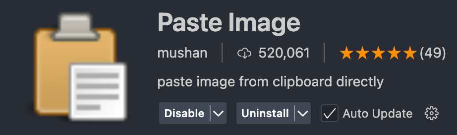

# Markdown Learning Notes


## 1. Learning Videos:
- [LinkedIn Learning - Learning Markdown](https://www.linkedin.com/learning/learning-markdown?u=69919578)

---

## 2. Suggested Plugins in Visual Studio Code:
- Markdown Preview Enhanced
  - 
  
- learn-markdown
  - 

- Paste Image
  - 

---

## 3. Common Markdown Syntax and Formats
### (1). Heading
Markdown supports six levels of headings, indicated by `#` symbols. For example:

```
# Heading Level 1
## Heading Level 2
### Heading Level 3
#### Heading Level 4
##### Heading Level 5
###### Heading Level 6
```

### (2). Paragraphs
Paragraphs are separated by one or more blank lines. Just use "enter" or "return" on your keyboard. For example:

```

Above is a paragraph.

Above is another paragraph.
```

### (3). Table
```
| Column 1 | Column 2 | Column 3 |
| -------- | -------- | -------- |
| Data 1   | Data 2   | Data 3   |
| Data 4   | Data 5   | Data 6   |
```

### (4). Font Style

|       Font        |     Code      |
| :---------------: | :-----------: |
|     **Bold**      |     ** **     |
|     *Italic*      |      * *      |
|   ==Highlight==   |     == ==     |
| ***Bold Italic*** |    *** ***    |
|    ~~delete~~     |     ~~ ~~     |
| <u>underline</u>  | ```<u></u>``` |

```
|       Font        |     Code      |
| :---------------: | :-----------: |
|     **Bold**      |     ** **     |
|     *Italic*      |      * *      |
|   ==Highlight==   |     == ==     |
| ***Bold Italic*** |    *** ***    |
|    ~~delete~~     |     ~~ ~~     |
| <u>underline</u>  | ```<u></u>``` |
```

### (5). Unordered Lists
Use ```-```, ```*```, or ```+``` to create unordered list items.
- Item 1
  - Subitem 1
  - Subitem 2
- Item 2
  ```
  - Item 1
    - Subitem 1
    - Subitem 2
  - Item 2
  ```

* Item 1
* Item 2
  * Subitem 1
  * Subitem 2
* Item 3
  ```
  * Item 1
  * Item 2
    * Subitem 1
    * Subitem 2
  * Item 3
  ```

+ Item 1
  + Subitem
+ Item 2
  + Subitem
+ Item 3
  + Subitem
  ```
  + Item 1
    + Subitem
  + Item 2
    + Subitem
  + Item 3
    + Subitem
  ```


### (6). Blockquote
Create blockquotes with the ```>``` symbol:
> "The Markdown Guide is a free and open-source reference guide that explains how to use Markdown, the simple and easy-to-use markup language you can use to format virtually any document".
```
> "The Markdown Guide is a free and open-source..."
```

### (7). Code
- Inline code uses backticks ``` ` ```:
  ```
  `enter code here`
  ```
- Code blocks use three backticks ` ``` ` or indent with four spaces
  ```
  ```code here```
  ```

  ```
      code here
  ```

- Specify a programming language at the beginning of a code block to enable syntax highlighting:
  ```python
  def hello_world():
    print("Hello, world!")
  ```

  ```
  ```python
  def hello_world():
    print("Hello, world!")
  ```

### (8). Link
- Inline links use ```[text](URL)``` syntax:
[Google](https://www.google.com)
  ```
  [Google](https://www.google.com)
  ```
- You can add a title to the link when mouse hover on the link:
[Google](https://www.google.com "Click to visit Google")
  ```
  [Google](https://www.google.com "Click to visit Google")
  ```

### (9). Images
Images are similar to links but start with an exclamation mark ``` ! ```:


### (10). Hotizontal Line
Create a horizontal line using three or more hyphens ```---```


### (11). Task Lists
Markdown supports task lists using ```[ ]``` and ```[x]``` for incomplete and completed tasks:
- [ ] Task 1
- [x] Task 2 (Completed)
  
  ```
  - [ ] Task 1
  - [x] Task 2 (Completed)
  ```


### (12).  Footnote
In Markdown, the standard Markdown syntax does not natively support footnotes. 
For extensions that support footnotes, the syntax is usually as follows:
This is a text with a footnote[^1]. This is a text with a footnote[^2].
  [^1]: This is the content of the footnote.
  [^2]: This is the content of the footnote.
  ```
  This is a text with a footnote[^1]. This is a text with a footnote[^2].
  Footnote definitions:
  [^1]: This is the content of the footnote.
  [^2]: This is the content of the footnote.
  ```

