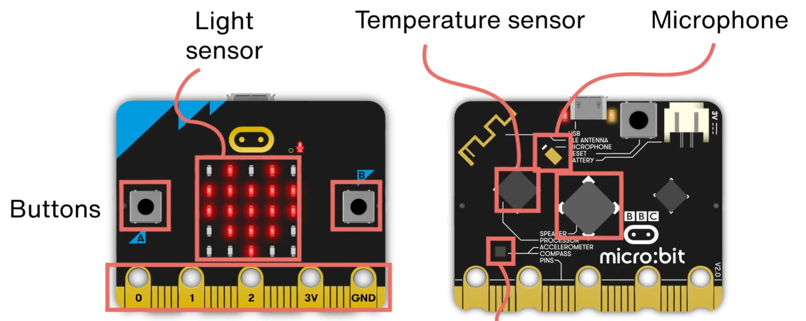
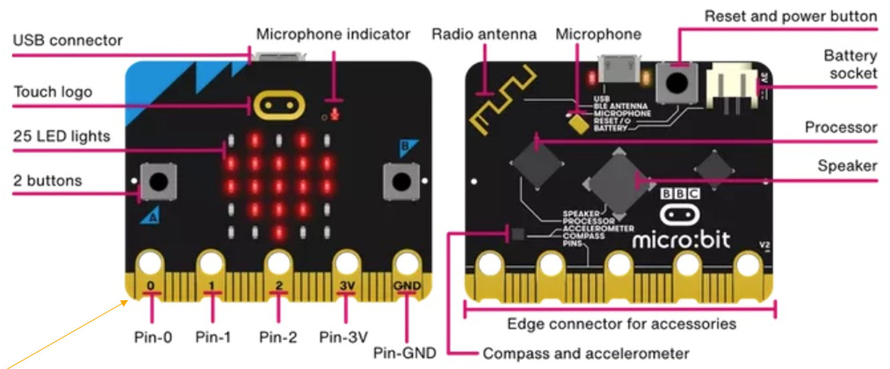

# Microbit Fundamentals
---
## Resources
- [The Differences Between micro:bit V1 And microbit V2](https://kitronik.co.uk/blogs/resources/explore-micro-bit-v1-microbit-v2-differences).
- [The Five Minute microbit Guide](https://kitronik.co.uk/blogs/resources/five-minute-microbit-guide)
- [User Guide - ‘Meet the micro:bit’ program](https://microbit.org/get-started/user-guide/meet-the-microbit-program/)
- [User Guide - Open Source](https://microbit.org/get-started/user-guide/open-source/)
- [Getting Started](https://microbit.org/get-started/getting-started/introduction/)
- [Getting Started - Tutorials on Youtube](https://www.youtube.com/playlist?list=PLEo0hMrjdoftkWhVVfu2sYvh6CIDhfA2n)
- [Projects using MakeCode](https://microbit.org/projects/make-it-code-it/?filters=makecode)
- [Coding Tutorials for Micro:bit Beginner](https://kitronik.co.uk/blogs/resources/tagged/coding-tutorials+difficulty-1-beginner+platform-micro-bit)
- [Options for Powering the BBC micro:bit](https://kitronik.co.uk/blogs/resources/powering-your-bbc-microbit)

---
## Useful Websites
- [Microsoft MadeCode Editor](https://makecode.microbit.org/)
- [MicroPython Editor](https://python.microbit.org/v/3)
- [WebSerial](https://webserial.io/)

---

| Annotation              | Function Description                                                                 |
| ----------------------- | ------------------------------------------------------------------------------------ |
| Touch Logo              | A touch sensor that can trigger events or interactions when touched.                 |
| Antenna                 | Used for wireless communication, such as Bluetooth or radio signal transmission.     |
| Microphone              | Captures sound signals for recording or sound recognition purposes.                  |
| Power LED               | An indicator light that illuminates when the device is powered on.                   |
| USB Port                | Connects to computers or other USB devices for data transfer or power supply.        |
| Power Switch            | A switch to turn the device's power on or off.                                       |
| Processor               | The 'brain' of the device, executing programs and processing data.                   |
| Accelerometer           | Detects motion and orientation of the device, useful for gaming or motion detection. |
| Display                 | Shows text, graphics, or other visual information to the user.                       |
| Sounder                 | Emits sound for alerts or sound effects.                                             |
| JST Power Connector     | Connects to an external power source for power supply or charging.                   |
| Notched Edge Connector  | A physical connection point for linking with other devices or modules.               |
| User-Assignable Buttons | Buttons that can be programmed by the user to perform specific functions or tasks.   |
| Connector: 3V           | A pin that provides 3 volts of power to the device.                                  |
| Connector: GND          | A ground pin for the circuit, used as a common reference point.                      |

## Features

| Feature          | Description                                      |
| ---------------- | ------------------------------------------------ |
| **Size**         | Small, palm-sized                                |
| **Display**      | LED matrix for output                            |
| **Buttons**      | Input via buttons A and B                        |
| **Sensors**      | Accelerometer and compass                        |
| **Connectivity** | Bluetooth for communication with other devices   |
| **Programming**  | Easy-to-use online IDE and programming languages |

---
## Pins
5 circular holes on the BBC micro:bit are **general interfaces** for connecting external electronic components, designed to allow users to quickly build circuits without soldering (for example, using crocodile clips). Here are the detailed functions of each hole:
- **GPIO pins (0, 1, 2)**
Function: General Purpose Input/Output pins, programmable for control.
  - **Pin 0**: Often used for connecting buttons, touch sensors (micro:bit V2 supports capacitive touch).
  - **Pins 1 and 2**: Often used as PWM outputs (such as controlling servos, LED brightness) or reading analog signals (such as light-dependent resistors, temperature sensors).
  Example: Connect an LED to GPIO and GND with crocodile clips and program it to blink.
- **3V Power hole**
Function: Provides 3V DC voltage to power external components (such as sensors, small motors).
Note: The output current is limited (about 300mA), and high-power devices require an external power supply.
- **GND (Ground)**
Function: Common ground terminal for the circuit to close the loop.
Example: When connecting a sensor, you need to connect both the signal line (such as GPIO) and GND.

**Precautions**
- Prevent short circuits: Avoid direct contact between 3V and GND.
- Voltage matching: The operating voltage of external components should be ≤3V (such as using a 3V servo model).
- Static electricity protection: Touch a metal object to discharge before operating in a dry environment.

---
## Comparison with Arduino
- **Microbit**:
  - Designed for education, simpler programming.
  - Integrated sensors and Bluetooth.
- **Arduino**:
  - More versatile, suitable for complex projects.
  - Requires external components for similar functionality.

---
## Programming Languages
- **MicroPython**: Variant of Python optimized for Microbit.
- **Blocks Editor**: Visual programming environment for beginners.

